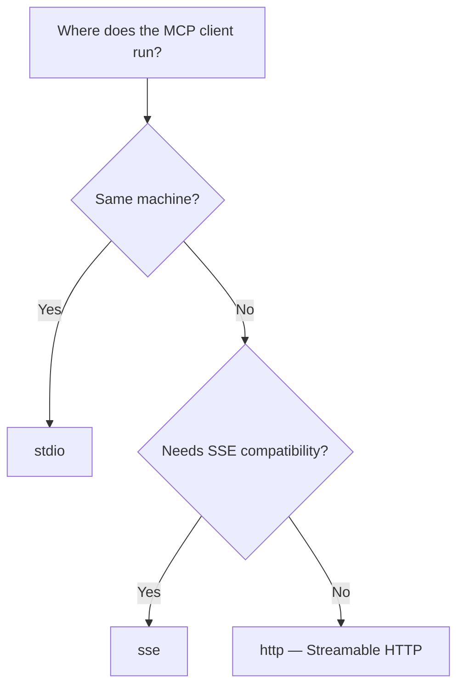

# Deployment

Run your MCP server in production — choose the right transport, validate `Host` and `Origin`, configure CORS for browser clients, deploy behind a reverse proxy, containerize with Docker, probe it from Kubernetes, run it under uvicorn or gunicorn, and use the CLI for zero-boilerplate startup.

## Transport Selection

Promptise supports three transports. Choose based on your deployment target:



| Transport | Protocol | Use case |
|-----------|----------|----------|
| `stdio` | stdin/stdout | Local integration: Claude Desktop, CLI tools, IDEs |
| `http` | Streamable HTTP | Remote agents, web apps, microservices, production |
| `sse` | Server-Sent Events | Legacy clients, environments that don't support Streamable HTTP |

### `stdio` — Local connections

```python
server = MCPServer(name="local-tools")
server.run(transport="stdio")
```

Best for Claude Desktop integration. The MCP client spawns your server as a subprocess and communicates via stdin/stdout. No network configuration needed.

```json title="Claude Desktop config"
{
  "mcpServers": {
    "my-tools": {
      "command": "python",
      "args": ["-m", "myapp.server"]
    }
  }
}
```

### `http` — Streamable HTTP (recommended for remote)

```python
server = MCPServer(name="remote-api")
server.run(
    transport="http",
    host="0.0.0.0",
    port=8080,
    allowed_hosts=["api.example.com"],   # Host header validation on a public bind
)
```

The server exposes a single endpoint at `/mcp` that handles all MCP protocol messages. Supports session tracking, bidirectional streaming, and concurrent requests. It also answers [`GET /health` and `GET /health/ready`](#health-probes) for container and Kubernetes probes.

`run()` binds `127.0.0.1` unless you pass `host`: the server is reachable from the same machine only, and `Host`/`Origin` validation is on. To listen on every interface — in a container, or behind a load balancer on another machine — pass `host="0.0.0.0"` and name the public host in `allowed_hosts`, as above.

!!! warning "Changed in the next release: the default bind is `127.0.0.1`"
    Up to 1.2.1, `run()` and `run_async()` defaulted to `host="0.0.0.0"`, which exposed an unauthenticated server to the whole network. A deployment that relied on that default — a container, or clients on other machines — must now pass `host="0.0.0.0"` explicitly (see [Docker](#docker)). `promptise serve`, `hot_reload()` and MCPcast-generated servers already defaulted to `127.0.0.1`.

#### Sessions, restarts and replicas

A Streamable HTTP session lives in the server process that created it. After a restart or redeploy, the server answers the old `mcp-session-id` with `404`; the MCP specification tells the client to open a new session, and Promptise clients (`MCPClient`, `MCPMultiClient`, `build_agent`) do so transparently — they re-initialise, retry the call once and re-discover the server's tools. See [Reconnecting after a server restart](../client/index.md#reconnecting-after-a-server-restart).

With **several replicas or workers**, a request that reaches a process other than the one that holds its session gets the same `404`. Route each `mcp-session-id` to one process (sticky sessions on the `mcp-session-id` header at the load balancer), or serve the app stateless — see [Running under uvicorn or gunicorn](#running-under-uvicorn-or-gunicorn).

### `sse` — Server-Sent Events (legacy)

```python
server = MCPServer(name="legacy-api")
server.run(
    transport="sse",
    host="0.0.0.0",
    port=8080,
    allowed_hosts=["api.example.com"],
)
```

Exposes `/sse` for the event stream and `/messages/` for client-to-server messages. Use this only when your client doesn't support Streamable HTTP.

### Identity is per request, not per session

Both network transports keep an MCP *session* open across many HTTP requests. Everything the framework derives from HTTP headers — `ctx.meta`, the credential `AuthMiddleware` verifies, `ctx.client` (client id, tenant, roles, IP address), and `ctx.request_id` from `X-Request-ID` — is read from the HTTP request that carries **that** `tools/call`, never from the request that opened the session. A caller that sends a different credential on a later call is that credential's principal for that call; a call without one is unauthenticated, even inside a session that was opened with a valid token.

With the transport auth gate on (`MCPServer(require_auth=True)`), the session is additionally bound to the credential that created it: a request that presents a *different* valid credential for a known `mcp-session-id` is answered `404 Session not found`, exactly as if the session did not exist. A client that rotates its token therefore opens a new session (re-initialises) — it cannot ride the old one, and neither can anyone who picked the session id out of a proxy log.

---

## Host and Origin Validation

### When you need it

A server bound to loopback is not reachable from the network — but it *is* reachable from a web page in the operator's browser. With **DNS rebinding**, a page served from `attacker.example` re-points that hostname at `127.0.0.1` after loading, and its scripts then talk to your MCP server with the browser's network position. If the server carries a credential of its own (an upstream token from the environment, for example), that page drives the upstream API with it.

The MCP Streamable HTTP specification requires servers to validate the `Origin` header for exactly this reason. Promptise validates `Host` and `Origin` at the transport, before any MCP message is parsed.

### Loopback binds are protected by default

Binding `127.0.0.1`, `localhost` or `::1` (any `127.0.0.0/8` address counts) turns the validation on with the loopback names on any port:

| Header | Accepted values |
|--------|-----------------|
| `Host` | `127.0.0.1[:port]`, `localhost[:port]`, `[::1][:port]` — plus the bind address itself |
| `Origin` | `http://` and `https://` forms of the same names, any port. A request **without** an `Origin` header (every non-browser MCP client) passes. |

A request whose `Host` is anything else gets `421 Misdirected Request`; a foreign `Origin` gets `403 Forbidden`. Both apply to the opening `initialize` and to every later request on the session, on the `/mcp` endpoint and on the SSE `/sse` stream and `/messages/` posts alike.

```python
server.run(transport="http", host="127.0.0.1", port=8080)   # protected, nothing to configure
```

`MCPServer.run()` and `promptise serve` bind `127.0.0.1` by default, so both inherit the protection.

### Public binds: name your hosts

A non-loopback bind (`0.0.0.0`, a LAN or public address) has **no** restriction unless you name the hosts you serve — the framework cannot guess the public hostname, and a wrong guess would refuse every request. Either terminate at a gateway that validates `Host` and `Origin` for you, or pass the lists explicitly:

```python
server.run(
    transport="http",
    host="0.0.0.0",
    port=8080,
    allowed_hosts=["api.example.com", "api.example.com:*"],   # exact, or any port with ":*"
    allowed_origins=["https://app.example.com"],              # browser clients on another origin
)
```

- `allowed_hosts` is the `Host` allow-list. Naming it turns the validation on for a public bind, where the list is used exactly as given.
- `allowed_origins` is the `Origin` allow-list for browser clients. Requests without an `Origin` header always pass it, so non-browser MCP clients need no entry. It requires `allowed_hosts` on a public bind (the transport validates `Host` whenever the protection is on; an empty host list would refuse everything — `run()` raises `ValueError` instead).
- `Origin` validation is not CORS: `CORSConfig` tells the *browser* which origins may read responses; the `Origin` check decides which origins the *server* accepts at all. Configure both for browser clients.

### Behind a reverse proxy

The [Nginx setup below](#reverse-proxy) forwards the public `Host` (`api.example.com`) to a backend bound on `127.0.0.1`. That backend is loopback-bound, so the validation is on — and it must know the public name. On a loopback bind the lists **add to** the loopback names (a request that names the bind address is by definition not rebound, and local health checks keep working):

```python
server.run(
    transport="http",
    host="127.0.0.1",
    port=8080,
    allowed_hosts=["api.example.com"],            # what the proxy forwards as Host
    allowed_origins=["https://app.example.com"],  # browser clients, if any
)
```

Without this, the proxied requests are answered `421` — the same answer a rebound page gets.

From the command line, the same lists are `--allowed-host` and `--allowed-origin` (repeatable) on `promptise serve` and on the `serve` argument parser (`build_serve_parser`), and `hot_reload(...)` passes them through to the child process:

```bash
promptise serve myapp.server:server -t http --host 0.0.0.0 \
    --allowed-host api.example.com --allowed-host api.example.com:* \
    --allowed-origin https://app.example.com
```

The policy is logged at startup by the `promptise.server` logger so a deployment can be checked from its logs:

| Bind | Level | Message |
|------|-------|---------|
| Validation on (loopback, or `allowed_hosts` given) | `INFO` | `Host/Origin validation on: hosts=[...] origins=[...]` |
| Non-loopback bind without `allowed_hosts` | `WARNING` | `Host/Origin validation off for non-loopback bind 0.0.0.0: ...` |
| Non-loopback bind without `AuthMiddleware` | `WARNING` | `MCP server 'name' is bound to 0.0.0.0:8080, which is reachable from other machines, and has no AuthMiddleware: ...` |

The warnings show under Python's default logging configuration; the `INFO` line needs `logging.basicConfig(level=logging.INFO)` (or your own handler at `INFO`) to appear.

---

## CORS Configuration

### When you need it

Your MCP server runs on `api.example.com:8080`. A web-based agent frontend on `app.example.com` needs to connect to it. Without CORS headers, the browser blocks the requests.

### `CORSConfig`

```python
from promptise.mcp.server import MCPServer, CORSConfig

server = MCPServer(name="web-api")

server.run(
    transport="http",
    host="0.0.0.0",
    port=8080,
    allowed_hosts=["api.example.com"],
    allowed_origins=["https://app.example.com"],          # the server accepts this Origin
    cors=CORSConfig(allow_origins=["https://app.example.com"]),  # the browser may read the answers
)
```

The defaults already cover what a browser MCP client needs: the preflight admits the MCP request headers, and the `mcp-session-id` the server assigns on `initialize` is exposed so the page can send it back on every later request. Name the origins; everything else can stay as it is.

A browser client needs **both** settings: `allowed_origins` (the server's `Origin` validation — without it the server answers `403`) and `CORSConfig.allow_origins` (the CORS headers — without them the browser hides the answer from the page).

### Configuration

| Parameter | Default | Description |
|-----------|---------|-------------|
| `allow_origins` | `[]` (none) | Allowed origin URLs. `["*"]` allows any origin |
| `allow_methods` | `["GET", "POST", "DELETE", "OPTIONS"]` | Allowed HTTP methods |
| `allow_headers` | `["Content-Type", "Authorization", "x-api-key", "mcp-session-id", "mcp-protocol-version", "last-event-id"]` | Request headers the preflight admits. If you replace the list, keep `mcp-session-id` and `mcp-protocol-version` — the browser refuses every request after `initialize` without them |
| `expose_headers` | `["mcp-session-id"]` | Response headers the page may read. Without `mcp-session-id` a browser client cannot continue the session it opened |
| `allow_credentials` | `False` | Allow cookies and auth headers. Cannot be combined with `allow_origins=["*"]` — `CORSConfig` raises `ValueError` |
| `max_age` | `600` | Preflight cache duration (seconds) |

`allow_origins=["*"]` together with `allow_credentials=True` is refused: the CORS layer would then echo *every* requesting origin back with `Access-Control-Allow-Credentials: true`, so any website could make credentialed requests to the server and read the answers. List the origins that need credentials explicitly.

The CORS layer sits in front of the transport auth gate: a preflight carries no credentials, so it is answered before authentication, and a `401` from the gate carries the CORS headers so the page can read it.

### Development vs production

```python
import os

if os.getenv("ENV") == "production":
    origins = ["https://app.yourcompany.com"]
else:
    origins = ["http://localhost:5173"]  # your dev frontend

server.run(
    transport="http",
    port=8080,
    allowed_origins=origins,
    cors=CORSConfig(allow_origins=origins),
)
```

---

## Authentication at the Transport Level

### When you need it

You want to reject unauthenticated HTTP requests **before** they reach MCP protocol handling. This prevents unauthenticated sessions from being created.

### Transport-level auth gate

```python
from promptise.mcp.server import AuthMiddleware, JWTAuth, MCPServer

server = MCPServer(name="secure-api", require_auth=True)   # every tool authenticates,
                                                           # and the gate is armed
jwt = JWTAuth(secret="your-secret-key")
server.add_middleware(AuthMiddleware(jwt))

server.run(transport="http", host="127.0.0.1", port=8080)
```

With `require_auth=True` and an `AuthMiddleware` installed, the server checks every HTTP request for:

1. **Bearer token**: `Authorization: Bearer <jwt-token>` — verified with the configured auth provider
2. **API key**: `x-api-key: <key>` — verified with the API key provider

Unauthenticated requests receive a `401` JSON response:

```json
{
  "error": "Authentication required",
  "message": "Pass a Bearer token via the Authorization header or an API key via the x-api-key header."
}
```

The gate also binds each MCP session to the credential that opened it. A request that presents a different valid credential for an existing `mcp-session-id` is answered `404 Session not found`; a client whose token changes opens a new session. Inside a session, the credential on each request is still what `AuthMiddleware` verifies and what `ctx.client` describes — see [Identity is per request, not per session](#identity-is-per-request-not-per-session).

### Built-in token endpoint

For development and testing, you can enable a built-in token endpoint that issues JWTs with the OAuth2 `client_credentials` flow:

```python
from promptise.mcp.server import AuthMiddleware, JWTAuth, MCPServer

server = MCPServer(name="secure-api", require_auth=True)
jwt = JWTAuth(secret="dev-secret")
server.add_middleware(AuthMiddleware(jwt))

server.enable_token_endpoint(
    jwt,
    clients={"my-agent": {"secret": "agent-secret", "roles": ["reader"]}},
    path="/auth/token",
)

server.run(transport="http", host="127.0.0.1", port=8080)
```

```bash
# Get a token
curl -X POST http://localhost:8080/auth/token \
  -H "Content-Type: application/json" \
  -d '{"client_id": "my-agent", "client_secret": "agent-secret"}'

# Use the token
curl http://localhost:8080/mcp \
  -H "Authorization: Bearer <token>"
```

The token endpoint is automatically excluded from the auth gate (it issues tokens, so it can't require one), and so are the [health probes](#health-probes) (probes carry no credentials). See [Token Endpoint](auth-security.md#token-endpoint-devtesting) for the full options.

---

## Reverse Proxy

### Nginx

```nginx
upstream mcp_backend {
    server 127.0.0.1:8080;
}

server {
    listen 443 ssl;
    server_name api.example.com;

    ssl_certificate     /etc/ssl/certs/api.example.com.pem;
    ssl_certificate_key /etc/ssl/private/api.example.com.key;

    location /mcp {
        proxy_pass http://mcp_backend;
        proxy_http_version 1.1;

        # Required for Streamable HTTP
        proxy_set_header Upgrade $http_upgrade;
        proxy_set_header Connection "upgrade";
        proxy_set_header Host $host;
        proxy_set_header X-Real-IP $remote_addr;
        proxy_set_header X-Forwarded-For $proxy_add_x_forwarded_for;
        proxy_set_header X-Forwarded-Proto $scheme;

        # SSE requires long-lived connections
        proxy_read_timeout 86400s;
        proxy_buffering off;
    }
}
```

### Key proxy settings

| Setting | Why |
|---------|-----|
| `proxy_buffering off` | SSE and streaming responses must not be buffered |
| `proxy_read_timeout 86400s` | MCP sessions are long-lived |
| `proxy_http_version 1.1` | Required for keep-alive and upgrade |
| `Connection "upgrade"` | Required for WebSocket-like transports |
| `proxy_set_header Host $host` | Forwards the public host — list it in `allowed_hosts` on the backend, see [Host and Origin Validation](#behind-a-reverse-proxy) |

---

## Docker

### Dockerfile

```dockerfile
FROM python:3.12-slim

WORKDIR /app

# Install dependencies
COPY pyproject.toml .
RUN pip install --no-cache-dir .

# Copy application code
COPY src/ src/

# Expose port
EXPOSE 8080

# Run the MCP server
CMD ["python", "-m", "myapp.server"]
```

Inside a container the server must listen on every interface — the default `127.0.0.1` is unreachable from outside it, so a container is the one place to bind `0.0.0.0` on purpose. Read the bind and the public host name from the environment, and keep [authentication](#authentication-at-the-transport-level) on: a non-loopback bind without `AuthMiddleware` logs a startup warning because every tool is then open to anyone who can reach the port.

```python title="myapp/server.py"
import os

if __name__ == "__main__":
    server.run(
        transport="http",
        host=os.environ.get("HOST", "0.0.0.0"),
        port=int(os.environ.get("PORT", "8080")),
        allowed_hosts=os.environ["ALLOWED_HOSTS"].split(","),  # e.g. "mcp.example.com"
    )
```

### docker-compose.yml

```yaml
services:
  mcp-server:
    build: .
    ports:
      - "8080:8080"
    environment:
      - OPENAI_API_KEY=${OPENAI_API_KEY}
      - DATABASE_URL=postgresql://db:5432/myapp
      - ALLOWED_HOSTS=mcp.example.com
    healthcheck:
      # python:*-slim images ship without curl; a failed check (503) raises.
      test: ["CMD", "python", "-c", "import urllib.request; urllib.request.urlopen('http://127.0.0.1:8080/health/ready')"]
      interval: 30s
      timeout: 10s
      retries: 3
    depends_on:
      - db

  db:
    image: postgres:16
    environment:
      POSTGRES_DB: myapp
      POSTGRES_PASSWORD: ${DB_PASSWORD}
    volumes:
      - pgdata:/var/lib/postgresql/data

volumes:
  pgdata:
```

### Health probes

A probe cannot speak MCP — a plain `GET /mcp` is answered `406 Not Acceptable` — so the HTTP and SSE transports serve two plain routes next to the MCP endpoint:

| Route | Answers | Use as |
|-------|---------|--------|
| `GET /health` | `200 {"status": "alive", ...}` while the process serves HTTP | Liveness probe |
| `GET /health/ready` | `200` when every check registered with `required_for_ready=True` passes, `503` otherwise. Body: `{"status": "ready" \| "not_ready", "checks": {"database": {"healthy": true}}}` | Readiness probe, Docker `healthcheck` |

Without a registered `HealthCheck`, `/health/ready` answers `200 {"status": "ready", "checks": {}}`. Both routes skip the transport auth gate and `Host` validation (a Kubernetes probe sends the pod IP as `Host` and no credentials), are never cached, and never include the text of an exception a check raised — the `health://readiness` MCP resource keeps that detail for authenticated callers.

```python
from promptise.mcp.server import MCPServer, HealthCheck

server = MCPServer(name="k8s-api")
health = HealthCheck()

async def check_db() -> bool:
    try:
        await db.execute("SELECT 1")
        return True
    except Exception:
        return False

health.add_check("database", check_db, required_for_ready=True)
health.register_resources(server)   # health://liveness, health://readiness, and GET /health/ready
```

```yaml title="Kubernetes deployment"
apiVersion: apps/v1
kind: Deployment
spec:
  template:
    spec:
      containers:
        - name: mcp-server
          image: myapp:latest
          ports:
            - containerPort: 8080
          env:
            - name: ALLOWED_HOSTS
              value: mcp.example.com
          livenessProbe:
            httpGet:
              path: /health
              port: 8080
            initialDelaySeconds: 5
            periodSeconds: 10
          readinessProbe:
            httpGet:
              path: /health/ready
              port: 8080
            periodSeconds: 5
            failureThreshold: 2
```

With more than one replica behind a Kubernetes `Service`, keep each MCP session on its pod — see [Sessions, restarts and replicas](#sessions-restarts-and-replicas).

---

## Running under uvicorn or gunicorn

`run()` starts its own uvicorn server. To use your own ASGI server — uvicorn with your flags, gunicorn with worker processes, hypercorn — take the application from `asgi_app()`:

```python title="myapp/asgi.py"
import os

from myapp.server import server

app = server.asgi_app(
    allowed_hosts=os.environ["ALLOWED_HOSTS"].split(","),   # e.g. "mcp.example.com"
)
```

```bash
uvicorn myapp.asgi:app --host 0.0.0.0 --port 8080
gunicorn myapp.asgi:app -k uvicorn.workers.UvicornWorker -w 4 -b 0.0.0.0:8080
```

The app serves the same routes as `run()` — `/mcp` (or `/sse` and `/messages/` with `asgi_app("sse")`), `/health`, `/health/ready` and the token endpoint — with the same auth gate and CORS (`cors=CORSConfig(...)`). Its lifespan runs your startup and shutdown hooks and the MCP session manager, so leave the ASGI server's lifespan handling on (uvicorn's default).

The ASGI server owns the bind address, so `Host` validation cannot follow it: the app always accepts the loopback names, plus everything in `allowed_hosts` (and `allowed_origins` for browser clients). Name the host your clients or proxy send, or their requests are answered `421`.

### Several workers: sticky sessions or stateless

Each worker process keeps its own MCP sessions. With `-w 4`, a request whose session lives in another worker is answered `404`, and the client re-initialises — on nearly every call. Either:

- run **one worker per replica** and route each `mcp-session-id` to its replica (sticky sessions at the load balancer), or
- serve **stateless**: `server.asgi_app(stateless=True, allowed_hosts=[...])`. Every request is self-contained — no `mcp-session-id` — so any worker or replica can answer it. A stateless server cannot send requests back to the client, so MCP elicitation and sampling (including [elicitation approval gates](approval-gates.md)) and per-session state are unavailable. `stateless` applies to Streamable HTTP only.

---

## CLI Serve

### When you need it

You want to run your MCP server without writing `if __name__ == "__main__"` boilerplate. The CLI handles argument parsing, transport selection, and hot reload.

### Usage

```bash
# Default: stdio transport
promptise serve myapp.server:server

# HTTP with specific port
promptise serve myapp.server:server -t http -p 9090

# With hot reload for development
promptise serve myapp.server:server -t http --reload

# With live dashboard
promptise serve myapp.server:server -t http --dashboard
```

### Target format

```
module.path:attribute_name
```

The CLI imports the module and gets the named attribute, which must be an `MCPServer` instance:

```python title="myapp/server.py"
from promptise.mcp.server import MCPServer

# This is what the CLI imports
server = MCPServer(name="my-tools")

@server.tool()
async def greet(name: str) -> str:
    return f"Hello, {name}!"
```

```bash
promptise serve myapp.server:server
```

### Options

| Flag | Default | Description |
|------|---------|-------------|
| `--transport`, `-t` | `stdio` | `stdio`, `http`, or `sse` |
| `--host` | `127.0.0.1` | Bind host |
| `--port`, `-p` | `8080` | Bind port |
| `--dashboard` | off | Live terminal dashboard |
| `--reload` | off | Hot reload on file changes |
| `--allowed-host HOST` | none | `Host` header value to accept on HTTP/SSE, e.g. `api.example.com` or `api.example.com:*` (repeatable). A loopback bind validates `Host` and `Origin` against the loopback names by default and the list adds to them; a non-loopback bind validates only when this is given -- see [Host and Origin Validation](#host-and-origin-validation) |
| `--allowed-origin ORIGIN` | none | `Origin` header value to accept for browser clients, e.g. `https://app.example.com` (repeatable). Requires `--allowed-host` on a non-loopback bind |

---

## Hot Reload

For development, hot reload watches your Python files and restarts the server when changes are detected:

```python
from promptise.mcp.server import MCPServer, hot_reload

server = MCPServer(name="dev")

@server.tool()
async def hello(name: str) -> str:
    return f"Hello, {name}!"

if __name__ == "__main__":
    hot_reload(
        server,
        transport="http",
        port=8080,
        watch_dirs=["src/"],
        poll_interval=1.0,
    )
```

Or via the CLI:

```bash
promptise serve myapp.server:server -t http --reload
```

See [Advanced Patterns — Hot Reload](advanced-patterns.md#hot-reload) for details.

---

## Production Checklist

Before deploying to production:

- [ ] **Transport**: Use `http` (Streamable HTTP) for remote access, `stdio` for local
- [ ] **Authentication**: Enable `require_auth=True` with JWT or API key validation
- [ ] **Host/Origin validation**: Pass `allowed_hosts` (and `allowed_origins` for browser clients) on a public bind, or validate them at the gateway — loopback binds are protected by default
- [ ] **CORS**: Restrict `allow_origins` to your actual frontend domains
- [ ] **TLS**: Terminate TLS at the reverse proxy (Nginx, Caddy, cloud LB)
- [ ] **Bind**: `run()` binds `127.0.0.1` by default — pass `host="0.0.0.0"` (with `allowed_hosts` and `AuthMiddleware`) only where the server must be reachable from other machines; check the startup log for the `WARNING` lines listed under [Host and Origin Validation](#host-and-origin-validation)
- [ ] **Health checks**: Register `HealthCheck` with required dependency checks; point liveness at `/health` and readiness at `/health/ready`
- [ ] **Replicas**: Sticky sessions on `mcp-session-id`, or `asgi_app(stateless=True)`
- [ ] **Observability**: Add `MetricsMiddleware` or `OTelMiddleware` for monitoring
- [ ] **Rate limiting**: Add `RateLimitMiddleware` to prevent abuse
- [ ] **Circuit breakers**: Protect against flaky downstream dependencies
- [ ] **Audit logging**: Add `AuditMiddleware` for compliance
- [ ] **Process management**: Use systemd, supervisord, or Kubernetes — not `hot_reload`

## API Summary

| Symbol | Type | Description |
|--------|------|-------------|
| `CORSConfig(...)` | Dataclass | CORS settings for HTTP/SSE transports |
| `MCPServer.run(..., allowed_hosts=, allowed_origins=)` | Parameters | `Host`/`Origin` allow-lists for HTTP/SSE (loopback binds are protected by default; `host` defaults to `127.0.0.1`) |
| `MCPServer.asgi_app(transport=, allowed_hosts=, allowed_origins=, cors=, stateless=)` | Method | The server as an ASGI app for uvicorn, gunicorn or hypercorn |
| `GET /health`, `GET /health/ready` | HTTP routes | Liveness and readiness probes (readiness from `HealthCheck`, `503` when not ready) |
| `TransportType` | Enum | `STDIO`, `HTTP`, `SSE` |
| `hot_reload(server, ...)` | Function | File-watching dev server |
| `build_serve_parser(...)` | Function | CLI argument parser builder |
| `resolve_server(target)` | Function | Import server from `module:attr` |
| `run_serve(args)` | Function | Run server from CLI args |
| `TokenEndpointConfig(...)` | Dataclass | Built-in token endpoint config |

## What's Next

- [Authentication & Security](auth-security.md) — JWT, API keys, guards, roles
- [Caching & Performance](caching-performance.md) — Cache, rate limit, concurrency
- [Observability & Monitoring](observability.md) — Metrics, tracing, logging
- [Resilience Patterns](resilience-patterns.md) — Circuit breakers, health checks
