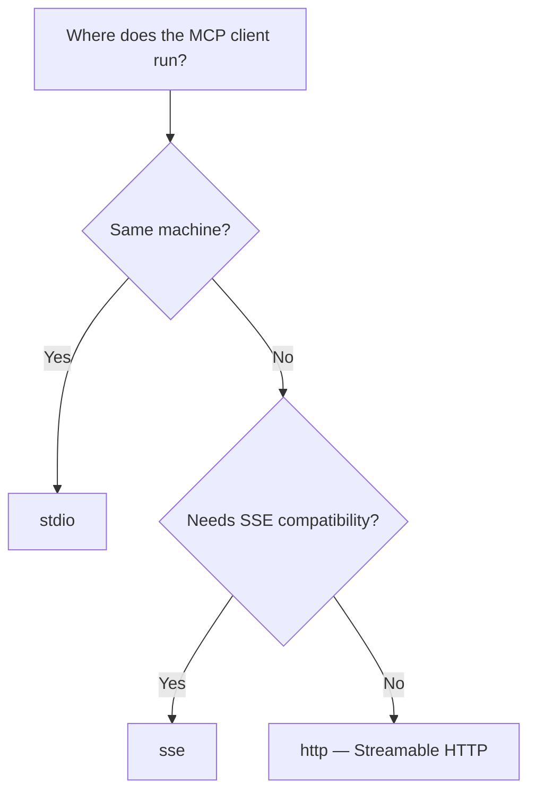

# Deployment

Run your MCP server in production — choose the right transport, validate `Host` and `Origin`, configure CORS for browser clients, deploy behind a reverse proxy, containerize with Docker, and use the CLI for zero-boilerplate startup.

## Transport Selection

Promptise supports three transports. Choose based on your deployment target:



| Transport | Protocol | Use case |
|-----------|----------|----------|
| `stdio` | stdin/stdout | Local integration: Claude Desktop, CLI tools, IDEs |
| `http` | Streamable HTTP | Remote agents, web apps, microservices, production |
| `sse` | Server-Sent Events | Legacy clients, environments that don't support Streamable HTTP |

### `stdio` — Local connections

```python
server = MCPServer(name="local-tools")
server.run(transport="stdio")
```

Best for Claude Desktop integration. The MCP client spawns your server as a subprocess and communicates via stdin/stdout. No network configuration needed.

```json title="Claude Desktop config"
{
  "mcpServers": {
    "my-tools": {
      "command": "python",
      "args": ["-m", "myapp.server"]
    }
  }
}
```

### `http` — Streamable HTTP (recommended for remote)

```python
server = MCPServer(name="remote-api")
server.run(
    transport="http",
    host="0.0.0.0",
    port=8080,
    allowed_hosts=["api.example.com"],   # Host header validation on a public bind
)
```

The server exposes a single endpoint at `/mcp` that handles all MCP protocol messages. Supports session tracking, bidirectional streaming, and concurrent requests.

### `sse` — Server-Sent Events (legacy)

```python
server = MCPServer(name="legacy-api")
server.run(
    transport="sse",
    host="0.0.0.0",
    port=8080,
    allowed_hosts=["api.example.com"],
)
```

Exposes `/sse` for the event stream and `/messages/` for client-to-server messages. Use this only when your client doesn't support Streamable HTTP.

### Identity is per request, not per session

Both network transports keep an MCP *session* open across many HTTP requests. Everything the framework derives from HTTP headers — `ctx.meta`, the credential `AuthMiddleware` verifies, `ctx.client` (client id, tenant, roles, IP address), and `ctx.request_id` from `X-Request-ID` — is read from the HTTP request that carries **that** `tools/call`, never from the request that opened the session. A caller that sends a different credential on a later call is that credential's principal for that call; a call without one is unauthenticated, even inside a session that was opened with a valid token.

With the transport auth gate on (`MCPServer(require_auth=True)`), the session is additionally bound to the credential that created it: a request that presents a *different* valid credential for a known `mcp-session-id` is answered `404 Session not found`, exactly as if the session did not exist. A client that rotates its token therefore opens a new session (re-initialises) — it cannot ride the old one, and neither can anyone who picked the session id out of a proxy log.

---

## Host and Origin Validation

### When you need it

A server bound to loopback is not reachable from the network — but it *is* reachable from a web page in the operator's browser. With **DNS rebinding**, a page served from `attacker.example` re-points that hostname at `127.0.0.1` after loading, and its scripts then talk to your MCP server with the browser's network position. If the server carries a credential of its own (an upstream token from the environment, for example), that page drives the upstream API with it.

The MCP Streamable HTTP specification requires servers to validate the `Origin` header for exactly this reason. Promptise validates `Host` and `Origin` at the transport, before any MCP message is parsed.

### Loopback binds are protected by default

Binding `127.0.0.1`, `localhost` or `::1` (any `127.0.0.0/8` address counts) turns the validation on with the loopback names on any port:

| Header | Accepted values |
|--------|-----------------|
| `Host` | `127.0.0.1[:port]`, `localhost[:port]`, `[::1][:port]` — plus the bind address itself |
| `Origin` | `http://` and `https://` forms of the same names, any port. A request **without** an `Origin` header (every non-browser MCP client) passes. |

A request whose `Host` is anything else gets `421 Misdirected Request`; a foreign `Origin` gets `403 Forbidden`. Both apply to the opening `initialize` and to every later request on the session, on the `/mcp` endpoint and on the SSE `/sse` stream and `/messages/` posts alike.

```python
server.run(transport="http", host="127.0.0.1", port=8080)   # protected, nothing to configure
```

`promptise serve` binds `127.0.0.1` by default, so it inherits the protection.

### Public binds: name your hosts

A non-loopback bind (`0.0.0.0`, a LAN or public address) has **no** restriction unless you name the hosts you serve — the framework cannot guess the public hostname, and a wrong guess would refuse every request. Either terminate at a gateway that validates `Host` and `Origin` for you, or pass the lists explicitly:

```python
server.run(
    transport="http",
    host="0.0.0.0",
    port=8080,
    allowed_hosts=["api.example.com", "api.example.com:*"],   # exact, or any port with ":*"
    allowed_origins=["https://app.example.com"],              # browser clients on another origin
)
```

- `allowed_hosts` is the `Host` allow-list. Naming it turns the validation on for a public bind, where the list is used exactly as given.
- `allowed_origins` is the `Origin` allow-list for browser clients. Requests without an `Origin` header always pass it, so non-browser MCP clients need no entry. It requires `allowed_hosts` on a public bind (the transport validates `Host` whenever the protection is on; an empty host list would refuse everything — `run()` raises `ValueError` instead).
- `Origin` validation is not CORS: `CORSConfig` tells the *browser* which origins may read responses; the `Origin` check decides which origins the *server* accepts at all. Configure both for browser clients.

### Behind a reverse proxy

The [Nginx setup below](#reverse-proxy) forwards the public `Host` (`api.example.com`) to a backend bound on `127.0.0.1`. That backend is loopback-bound, so the validation is on — and it must know the public name. On a loopback bind the lists **add to** the loopback names (a request that names the bind address is by definition not rebound, and local health checks keep working):

```python
server.run(
    transport="http",
    host="127.0.0.1",
    port=8080,
    allowed_hosts=["api.example.com"],            # what the proxy forwards as Host
    allowed_origins=["https://app.example.com"],  # browser clients, if any
)
```

Without this, the proxied requests are answered `421` — the same answer a rebound page gets.

From the command line, the same lists are `--allowed-host` and `--allowed-origin` (repeatable) on `promptise serve` and on the `serve` argument parser (`build_serve_parser`), and `hot_reload(...)` passes them through to the child process:

```bash
promptise serve myapp.server:server -t http --host 0.0.0.0 \
    --allowed-host api.example.com --allowed-host api.example.com:* \
    --allowed-origin https://app.example.com
```

The policy is logged at startup (`Host/Origin validation on: hosts=[...] origins=[...]`, or `off for non-loopback bind`) so a deployment can be checked from its logs.

---

## CORS Configuration

### When you need it

Your MCP server runs on `api.example.com:8080`. A web-based agent frontend on `app.example.com` needs to connect to it. Without CORS headers, the browser blocks the requests.

### `CORSConfig`

```python
from promptise.mcp.server import MCPServer, CORSConfig

server = MCPServer(name="web-api")

server.run(
    transport="http",
    port=8080,
    cors=CORSConfig(
        allow_origins=["https://app.example.com"],
        allow_methods=["GET", "POST", "DELETE", "OPTIONS"],
        allow_headers=["Authorization", "x-api-key", "Content-Type"],
        allow_credentials=True,
        max_age=3600,
    ),
)
```

### Configuration

| Parameter | Default | Description |
|-----------|---------|-------------|
| `allow_origins` | `["*"]` | Allowed origin URLs |
| `allow_methods` | `["GET", "POST", "DELETE", "OPTIONS"]` | Allowed HTTP methods |
| `allow_headers` | `["*"]` | Allowed request headers |
| `allow_credentials` | `False` | Allow cookies and auth headers |
| `max_age` | `600` | Preflight cache duration (seconds) |

### Development vs production

```python
import os

if os.getenv("ENV") == "production":
    cors = CORSConfig(
        allow_origins=["https://app.yourcompany.com"],
        allow_credentials=True,
    )
else:
    cors = CORSConfig(
        allow_origins=["*"],  # Allow everything in dev
    )

server.run(transport="http", port=8080, cors=cors)
```

---

## Authentication at the Transport Level

### When you need it

You want to reject unauthenticated HTTP requests **before** they reach MCP protocol handling. This prevents unauthenticated sessions from being created.

### Transport-level auth gate

```python
from promptise.mcp.server import AuthMiddleware, JWTAuth, MCPServer

server = MCPServer(name="secure-api", require_auth=True)   # every tool authenticates,
                                                           # and the gate is armed
jwt = JWTAuth(secret="your-secret-key")
server.add_middleware(AuthMiddleware(jwt))

server.run(transport="http", host="127.0.0.1", port=8080)
```

With `require_auth=True` and an `AuthMiddleware` installed, the server checks every HTTP request for:

1. **Bearer token**: `Authorization: Bearer <jwt-token>` — verified with the configured auth provider
2. **API key**: `x-api-key: <key>` — verified with the API key provider

Unauthenticated requests receive a `401` JSON response:

```json
{
  "error": "Authentication required",
  "message": "Pass a Bearer token via the Authorization header or an API key via the x-api-key header."
}
```

The gate also binds each MCP session to the credential that opened it. A request that presents a different valid credential for an existing `mcp-session-id` is answered `404 Session not found`; a client whose token changes opens a new session. Inside a session, the credential on each request is still what `AuthMiddleware` verifies and what `ctx.client` describes — see [Identity is per request, not per session](#identity-is-per-request-not-per-session).

### Built-in token endpoint

For development and testing, you can enable a built-in token endpoint that issues JWTs with the OAuth2 `client_credentials` flow:

```python
from promptise.mcp.server import AuthMiddleware, JWTAuth, MCPServer

server = MCPServer(name="secure-api", require_auth=True)
jwt = JWTAuth(secret="dev-secret")
server.add_middleware(AuthMiddleware(jwt))

server.enable_token_endpoint(
    jwt,
    clients={"my-agent": {"secret": "agent-secret", "roles": ["reader"]}},
    path="/auth/token",
)

server.run(transport="http", host="127.0.0.1", port=8080)
```

```bash
# Get a token
curl -X POST http://localhost:8080/auth/token \
  -H "Content-Type: application/json" \
  -d '{"client_id": "my-agent", "client_secret": "agent-secret"}'

# Use the token
curl http://localhost:8080/mcp \
  -H "Authorization: Bearer <token>"
```

The token endpoint is automatically excluded from the auth gate (it issues tokens, so it can't require one). See [Token Endpoint](auth-security.md#token-endpoint-devtesting) for the full options.

---

## Reverse Proxy

### Nginx

```nginx
upstream mcp_backend {
    server 127.0.0.1:8080;
}

server {
    listen 443 ssl;
    server_name api.example.com;

    ssl_certificate     /etc/ssl/certs/api.example.com.pem;
    ssl_certificate_key /etc/ssl/private/api.example.com.key;

    location /mcp {
        proxy_pass http://mcp_backend;
        proxy_http_version 1.1;

        # Required for Streamable HTTP
        proxy_set_header Upgrade $http_upgrade;
        proxy_set_header Connection "upgrade";
        proxy_set_header Host $host;
        proxy_set_header X-Real-IP $remote_addr;
        proxy_set_header X-Forwarded-For $proxy_add_x_forwarded_for;
        proxy_set_header X-Forwarded-Proto $scheme;

        # SSE requires long-lived connections
        proxy_read_timeout 86400s;
        proxy_buffering off;
    }
}
```

### Key proxy settings

| Setting | Why |
|---------|-----|
| `proxy_buffering off` | SSE and streaming responses must not be buffered |
| `proxy_read_timeout 86400s` | MCP sessions are long-lived |
| `proxy_http_version 1.1` | Required for keep-alive and upgrade |
| `Connection "upgrade"` | Required for WebSocket-like transports |
| `proxy_set_header Host $host` | Forwards the public host — list it in `allowed_hosts` on the backend, see [Host and Origin Validation](#behind-a-reverse-proxy) |

---

## Docker

### Dockerfile

```dockerfile
FROM python:3.12-slim

WORKDIR /app

# Install dependencies
COPY pyproject.toml .
RUN pip install --no-cache-dir .

# Copy application code
COPY src/ src/

# Expose port
EXPOSE 8080

# Run the MCP server
CMD ["python", "-m", "myapp.server"]
```

### docker-compose.yml

```yaml
services:
  mcp-server:
    build: .
    ports:
      - "8080:8080"
    environment:
      - OPENAI_API_KEY=${OPENAI_API_KEY}
      - DATABASE_URL=postgresql://db:5432/myapp
    healthcheck:
      test: ["CMD", "curl", "-f", "http://localhost:8080/mcp"]
      interval: 30s
      timeout: 10s
      retries: 3
    depends_on:
      - db

  db:
    image: postgres:16
    environment:
      POSTGRES_DB: myapp
      POSTGRES_PASSWORD: ${DB_PASSWORD}
    volumes:
      - pgdata:/var/lib/postgresql/data

volumes:
  pgdata:
```

### Health checks with Kubernetes

```python
from promptise.mcp.server import MCPServer, HealthCheck

server = MCPServer(name="k8s-api")
health = HealthCheck()

async def check_db() -> bool:
    try:
        await db.execute("SELECT 1")
        return True
    except Exception:
        return False

health.add_check("database", check_db, required_for_ready=True)
health.register_resources(server)
```

```yaml title="Kubernetes deployment"
apiVersion: apps/v1
kind: Deployment
spec:
  template:
    spec:
      containers:
        - name: mcp-server
          image: myapp:latest
          ports:
            - containerPort: 8080
          # MCP health checks are exposed as resources,
          # but for k8s probes you need HTTP endpoints.
          # Use the /mcp endpoint as a basic liveness probe.
          livenessProbe:
            httpGet:
              path: /mcp
              port: 8080
            initialDelaySeconds: 5
            periodSeconds: 10
```

---

## CLI Serve

### When you need it

You want to run your MCP server without writing `if __name__ == "__main__"` boilerplate. The CLI handles argument parsing, transport selection, and hot reload.

### Usage

```bash
# Default: stdio transport
promptise serve myapp.server:server

# HTTP with specific port
promptise serve myapp.server:server -t http -p 9090

# With hot reload for development
promptise serve myapp.server:server -t http --reload

# With live dashboard
promptise serve myapp.server:server -t http --dashboard
```

### Target format

```
module.path:attribute_name
```

The CLI imports the module and gets the named attribute, which must be an `MCPServer` instance:

```python title="myapp/server.py"
from promptise.mcp.server import MCPServer

# This is what the CLI imports
server = MCPServer(name="my-tools")

@server.tool()
async def greet(name: str) -> str:
    return f"Hello, {name}!"
```

```bash
promptise serve myapp.server:server
```

### Options

| Flag | Default | Description |
|------|---------|-------------|
| `--transport`, `-t` | `stdio` | `stdio`, `http`, or `sse` |
| `--host` | `127.0.0.1` | Bind host |
| `--port`, `-p` | `8080` | Bind port |
| `--dashboard` | off | Live terminal dashboard |
| `--reload` | off | Hot reload on file changes |
| `--allowed-host HOST` | none | `Host` header value to accept on HTTP/SSE, e.g. `api.example.com` or `api.example.com:*` (repeatable). A loopback bind validates `Host` and `Origin` against the loopback names by default and the list adds to them; a non-loopback bind validates only when this is given -- see [Host and Origin Validation](#host-and-origin-validation) |
| `--allowed-origin ORIGIN` | none | `Origin` header value to accept for browser clients, e.g. `https://app.example.com` (repeatable). Requires `--allowed-host` on a non-loopback bind |

---

## Hot Reload

For development, hot reload watches your Python files and restarts the server when changes are detected:

```python
from promptise.mcp.server import MCPServer, hot_reload

server = MCPServer(name="dev")

@server.tool()
async def hello(name: str) -> str:
    return f"Hello, {name}!"

if __name__ == "__main__":
    hot_reload(
        server,
        transport="http",
        port=8080,
        watch_dirs=["src/"],
        poll_interval=1.0,
    )
```

Or via the CLI:

```bash
promptise serve myapp.server:server -t http --reload
```

See [Advanced Patterns — Hot Reload](advanced-patterns.md#hot-reload) for details.

---

## Production Checklist

Before deploying to production:

- [ ] **Transport**: Use `http` (Streamable HTTP) for remote access, `stdio` for local
- [ ] **Authentication**: Enable `require_auth=True` with JWT or API key validation
- [ ] **Host/Origin validation**: Pass `allowed_hosts` (and `allowed_origins` for browser clients) on a public bind, or validate them at the gateway — loopback binds are protected by default
- [ ] **CORS**: Restrict `allow_origins` to your actual frontend domains
- [ ] **TLS**: Terminate TLS at the reverse proxy (Nginx, Caddy, cloud LB)
- [ ] **Health checks**: Register `HealthCheck` with required dependency checks
- [ ] **Observability**: Add `MetricsMiddleware` or `OTelMiddleware` for monitoring
- [ ] **Rate limiting**: Add `RateLimitMiddleware` to prevent abuse
- [ ] **Circuit breakers**: Protect against flaky downstream dependencies
- [ ] **Audit logging**: Add `AuditMiddleware` for compliance
- [ ] **Process management**: Use systemd, supervisord, or Kubernetes — not `hot_reload`

## API Summary

| Symbol | Type | Description |
|--------|------|-------------|
| `CORSConfig(...)` | Dataclass | CORS settings for HTTP/SSE transports |
| `MCPServer.run(..., allowed_hosts=, allowed_origins=)` | Parameters | `Host`/`Origin` allow-lists for HTTP/SSE (loopback binds are protected by default) |
| `TransportType` | Enum | `STDIO`, `HTTP`, `SSE` |
| `hot_reload(server, ...)` | Function | File-watching dev server |
| `build_serve_parser(...)` | Function | CLI argument parser builder |
| `resolve_server(target)` | Function | Import server from `module:attr` |
| `run_serve(args)` | Function | Run server from CLI args |
| `TokenEndpointConfig(...)` | Dataclass | Built-in token endpoint config |

## What's Next

- [Authentication & Security](auth-security.md) — JWT, API keys, guards, roles
- [Caching & Performance](caching-performance.md) — Cache, rate limit, concurrency
- [Observability & Monitoring](observability.md) — Metrics, tracing, logging
- [Resilience Patterns](resilience-patterns.md) — Circuit breakers, health checks
