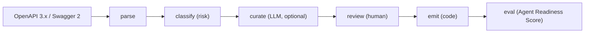
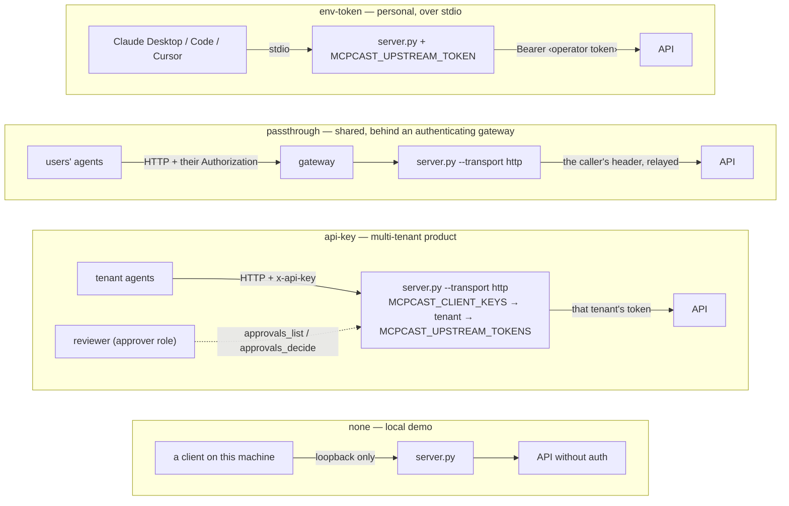

# MCPcast an Existing API

`promptise mcpcast` turns an existing HTTP API — any OpenAPI 3.x or Swagger 2
document — into a **curated, safe, agent-ready MCP server**, emitted as
editable code. Point it at a spec and you get `<name>-mcp/`: a reviewable
tool plan (`mcpcast.plan.yaml`), a real Promptise `MCPServer` as an installable
package with a test suite, a launcher, a `Dockerfile` and a README with install
snippets, so Claude Desktop, Claude Code, Cursor or a Promptise agent can use
your product through MCP. It is read-only by default;
anything that changes data is only generated when you opt in, and then demands
human approval enforced **server-side** for any MCP client.

**Source:** `src/promptise/mcpcast/` (`parse.py`, `classify.py`, `plan.py`,
`curate.py`, `emit.py`, `readiness.py`, `schema.py`) and the `mcpcast` command
in `src/promptise/cli.py`

## Why

- **200 endpoints are not 20 tools.** An API surface designed for developers
  is not a tool surface an agent can use. One tool per route buries the model
  in near-duplicates, kitchen-sink parameters and descriptions written for
  humans reading reference docs. Success is a *small* set of intent tools —
  `find_customer`, `cancel_subscription` — that the model picks correctly.
- **"The AI deleted our data."** Handing an agent a raw API is how that
  headline happens. `mcpcast` classifies every operation's risk with fixed,
  deterministic rules, generates nothing that changes data unless you opt in,
  and gates writes, deletes and money-moving calls behind a human decision the
  *server* enforces — not a courtesy of whichever client is calling.
- **"Use any AI with our product."** Instead of building yet another chat
  agent, MCPcast your application: one generated server, and every MCP-capable
  assistant your customers already run can drive it.

## Quick start

Five minutes, no model, no network beyond your own API. (Rather be asked than
type flags? `promptise mcpcast` with no arguments opens the
[guided setup](../../mcpcast/guided-setup.md).)

```bash
pip install promptise
promptise mcpcast openapi.yaml --no-curate --auth env-token
export MCPCAST_UPSTREAM_TOKEN="Bearer <your API token>"   # what the server sends upstream
```

Progress goes to stderr (stdout is reserved for the MCP protocol stream under
`--serve`):

```text
Parsed 6 operations from openapi.yaml; profile=read-only auth=env-token
╭──────────────────────── mcpcast ────────────────────────╮
│ petstore → petstore-mcp/                               │
│   tools: 2  (0 require human approval)                 │
│   not exposed: 4 operations (with reasons in the plan) │
│   files: petstore_mcp/ (8 modules), tests/ (2), server.py, README.md, pyproject.toml, │
│   Dockerfile, .env.example, .gitignore                                                 │
╰────────────────────────────────────────────────────────────────────────────────────────╯
```

The output directory defaults to `./<name>-mcp`, where the name is derived
from the spec's `info.title` (override with `--name` or `--output`). What is
in it is a project, not a script:

```text
petstore-mcp/
├── mcpcast.plan.yaml        # the source of truth — the only file you edit
├── server.py                # launcher: runs the package without installing it
├── pyproject.toml           # pip install -e .  →  the `petstore-mcp` command
├── README.md  .env.example  Dockerfile  .gitignore
├── petstore_mcp/            # config.py, upstream.py, approval.py, server.py, tools/<resource>.py
└── tests/                   # conftest.py + test_tools.py: every tool listed, routed, gated
```

`petstore_mcp/`, `server.py`, `tests/` and `README.md` are regenerated from
the plan every time (under `tools/`, only files carrying the generated header
are ever rewritten or removed — a hand-written module at a path the plan
gains makes regeneration refuse rather than overwrite it); `pyproject.toml`,
`Dockerfile`, `.env.example` and `.gitignore` are written once and then
yours, so `api.name` — the package and command they ship — is fixed after
the first write. The package depends only on `promptise` and `httpx`. Run it:

```bash
cd petstore-mcp
python server.py                        # stdio — for desktop clients
python server.py --transport http       # http://127.0.0.1:8080/mcp
promptise serve server:server -t http   # the launcher exposes `server`, so the serve CLI works too
pip install -e ".[dev]" && petstore-mcp # installed: a command (and `python -m petstore_mcp`)
pytest                                  # the generated tests
docker build -t petstore-mcp .          # the generated Dockerfile
```

Connect an AI — these are the snippets the generated `README.md` contains
for the `env-token` server the quick start built. The credential goes in
the client's own config: a desktop client launched from the GUI does not
inherit your shell, so `export MCPCAST_UPSTREAM_TOKEN=…` in a terminal would
never reach it.

**Claude Desktop** — add to `claude_desktop_config.json`:

```json
{
  "mcpServers": {
    "petstore": { "command": "python", "args": ["/absolute/path/to/server.py"], "env": {"MCPCAST_UPSTREAM_TOKEN": "Bearer <your API token>"} }
  }
}
```

**Claude Code:**

```bash
claude mcp add petstore -e MCPCAST_UPSTREAM_TOKEN="Bearer <your API token>" -- python /absolute/path/to/server.py
```

**Cursor** — add to `.cursor/mcp.json`:

```json
{
  "mcpServers": {
    "petstore": { "command": "python", "args": ["/absolute/path/to/server.py"], "env": {"MCPCAST_UPSTREAM_TOKEN": "Bearer <your API token>"} }
  }
}
```

**Promptise agent:**

```python
from promptise import build_agent, StdioServerSpec

agent = await build_agent(
    model="openai:gpt-5-mini",
    servers={
        "petstore": StdioServerSpec(
            command="python",
            args=["server.py"],
            env={"MCPCAST_UPSTREAM_TOKEN": "Bearer <your API token>"},
        )
    },
)
```

An `api-key` or `passthrough` server reads the caller's identity from a
request header, which no stdio launch can carry, so its README shows HTTP
configs instead: `python server.py --transport http`, then
`claude mcp add petstore --transport http http://127.0.0.1:8080/mcp --header "x-api-key: <key>"`
(or `--header "Authorization: Bearer <token>"`), a Cursor entry with `"url"`
and `"headers"`, and
`HTTPServerSpec(url="http://127.0.0.1:8080/mcp", api_key="<key>")` (or
`bearer_token="<token>"`) for a Promptise agent. Claude Desktop's
`claude_desktop_config.json` has no header field for HTTP servers, so it
cannot use such a server — the README says so rather than offering a config
that fails.

!!! note "Which auth mode?"
    `--auth env-token` is the right choice for a **personal** server launched
    over stdio by Claude Desktop, Claude Code or Cursor: every upstream call
    presents the one credential in `MCPCAST_UPSTREAM_TOKEN`. The default,
    `passthrough`, is for a **shared** HTTP/SSE deployment where each caller
    forwards their own `Authorization` header — a stdio client cannot send
    headers, so a passthrough server fails with `UPSTREAM_AUTH_MISSING` there.
    `--auth none` is for APIs that need no credentials. See
    [Auth modes](#auth-modes).

Then open the surface up, with curation and a review step:

```bash
promptise mcpcast openapi.yaml --profile standard --review      # reads + gated writes, model-curated
promptise mcpcast openapi.yaml --profile full --auth api-key --eval
```

## How it works



1. **Parse** — `load_spec()` accepts a file path, URL, inline JSON/YAML or a
   dict. `extract_operations()` flattens every operation with its method, path,
   per-parameter wire location (`path`, `query`, `body`, `raw_body`), local
   `$ref`s inlined (cycle- and depth-guarded), OAuth scopes, `deprecated`,
   tags and the success response schema. The base URL comes from
   `servers[0].url` (server variables resolved with their defaults) or the
   Swagger 2 `host`/`basePath`; when the spec was fetched from a URL, a
   relative server URL is resolved against it and a spec with no `servers`
   block at all uses that URL's origin. `--base-url` overrides all of that,
   and a spec that still has no absolute base URL fails with an error telling
   you to pass it.
2. **Classify** — every operation gets a risk class from a fixed, ordered rule
   set. No model, no network. See [Risk classification](#risk-classification).
3. **Curate** — on by default: a model designs the tool surface an agent needs
   within a budget, and code enforces every post-condition on its proposal.
   `--no-curate` is the fully offline path: one tool per operation, filtered by
   the profile. See [Curation](#curation).
4. **Review** — `--review` shows the kept and dropped tables and asks before
   writing. See [Review mode](#review-mode).
5. **Emit** — `write_project()` writes the project: `mcpcast.plan.yaml`, the
   `<name>_mcp/` package (config, HTTP client, approval gate, assembly, one
   tools module per resource), the `server.py` launcher, `tests/`,
   `README.md`, and the scaffold (`pyproject.toml`, `Dockerfile`,
   `.env.example`, `.gitignore`) on first write. The package depends only on
   `promptise` and `httpx`. Every tool parameter advertises the spec's JSON
   Schema in `tools/list` — enums, patterns, bounds, lengths, formats,
   defaults, nullability, `oneOf`/`anyOf`, nested objects with their
   `required` lists, descriptions — not just its Python type; `readOnly`
   properties are not inputs.
6. **Eval** — `--eval` drives the generated server with a real agent and
   grades it. See [Agent Readiness Score](#agent-readiness-score).

Nothing vanishes silently: every operation that does not become a tool lands
in the plan's `dropped` list **with a reason** — `deprecated in spec`,
`destructive operation excluded by profile 'standard'`, `over tool budget
(max_tools=10); …`, `not selected by curation`.

## Safety profiles

| Profile | `read` | `write` | `destructive` / `financial` |
|---|---|---|---|
| `read-only` *(default)* | exposed | **not generated** | **not generated** |
| `standard` | exposed | `requires_approval=True` | **not generated** |
| `full` | exposed | `requires_approval=True` | exposed, `requires_approval=True` |

Profiles are enforced by the plan schema itself, not just by the generator: a
`write` tool under `read-only`, or a non-read tool without
`requires_approval: true`, is an *invalid plan* and refuses to load. A `read`
tool may opt in to approval by hand. Deprecated operations are always dropped
(`deprecated in spec`) whatever the profile.

Approval is wired straight into shipped primitives:
`@server.tool(requires_approval=True)` plus an
[`ApprovalGateMiddleware`](approval-gates.md) installed by the generated
`build_server()`. A gated call that receives no decision within
`MCPCAST_APPROVAL_TIMEOUT` seconds (default `300`) is **denied**.

## Risk classification

The classifier is deterministic and ordered — the first matching rule wins:

| # | Rule | Class |
|---|---|---|
| 1 | Method is `GET`, `HEAD`, `OPTIONS` or `TRACE` | `read` |
| 2 | Method is `DELETE` | `destructive` |
| 3 | Operation id, path or summary mentions a destructive verb: `delete remove purge revoke terminate cancel deactivate destroy erase wipe reset` | `destructive` |
| 4 | …mentions money: `charge payment pay refund invoice transfer payout subscription billing checkout purchase withdraw deposit` | `financial` |
| 5 | A `POST` whose *leading* verb — the first word of the operation id or summary, or the last path segment — is a query verb (`search query find lookup list fetch preview validate calculate estimate`) and that mentions no mutating verb (`create add new update edit modify set save upload import register submit send finalize confirm capture activate archive accept complete verify apply invite redeliver ping generate assign attach publish execute run trigger start stop restart move rename replace merge sync approve reject enable disable login logout`) — `POST /orders/search` is a read, `POST /users/createWithList` is not, and `POST /graphql` is not (a GraphQL endpoint accepts mutations, so `graphql` is deliberately not a query verb) | `read` |
| 6 | Any other `POST`, `PUT` or `PATCH` | `write` |

The free-form `description` is never matched: prose that merely mentions
billing or deletion must not reclassify an ordinary write.

Then each **escalation signal** moves the result one step up the ladder
(`read → write → destructive`; `destructive` and `financial` stay put):

- an OAuth scope on the operation containing `admin`, `root` or `superuser`
  (a `write:` scope does not escalate — a scoped read is still a read);
- a path segment that is exactly `admin`, `internal`, `sudo` or `impersonate`;
- `deprecated: true`;
- a `GET`/`HEAD` whose id, path or summary contains a destructive verb as a
  whole word (`GET /users/{id}/delete`, `GET /logout` "Revoke the session") —
  a legacy side-effecting read is exposed only where writes are allowed.
  Money nouns on a `GET` (`GET /invoices`) are ordinary reads.

Matching is token-based and camelCase-aware (`cancelSubscription` hits
`cancel`), accepts simple plurals, and prefix-matches words of five or more
letters (`refund` → `refunded`) — short words never do, so `pay` cannot match
`payload`. Because rule 3 runs before rule 4, `POST /subscriptions/{id}/cancel`
is `destructive`, not `financial`. `destructive` and `financial` share the top
severity: both are excluded under `standard` and both are gated under `full`,
so reclassifying one as the other is neither an escalation nor a downgrade.

`classify()` explains itself:

```python
from promptise.mcpcast import classify, extract_operations, load_spec

for op in extract_operations(load_spec("openapi.yaml")):
    c = classify(op)
    print(op.operation_id, c.base.value, "->", c.risk.value, c.reasons)
```

```text
listPets    read        -> read         ['GET is a read']
createPet   write       -> write        ['POST is a write']
deletePet   destructive -> destructive  ['DELETE is destructive']
placeOrder  financial   -> financial    ["mentions money ('charge')"]
healthCheck read        -> write        ['GET is a read', 'escalated: deprecated']
```

Escalation is an *exposure* decision, not a semantic one: a deprecated or
admin-scoped read should not be handed to an agent under `read-only`.

## Curation

Curation is on by default and runs through `build_agent()` with `--model`
(default `openai:gpt-5-mini`, so `OPENAI_API_KEY` must be set) — the tool
dogfoods the framework it ships with. `--model` takes any provider string
Promptise understands, aliases included: `--model azure:chat-prod` (an Azure
OpenAI deployment), `--model foundry:Llama-3.3-70B-Instruct` (the Azure AI
Foundry catalog), `--model bedrock:...`, `--model gemini:...`; run
`promptise models check <string>` to see what a provider needs and see
[Model Setup](../../getting-started/model-setup.md) for the full list. The
model sees the full operation catalogue with each operation's classifier risk
and a budget (`--max-tools`, default `25`), and is asked to design the surface
an *agent* needs:

| Step | What the model does |
|---|---|
| **Budget** | Keep at most `max_tools` tools, ranked by usefulness to an end user's agent |
| **Drop** | Health checks, webhook receivers, internal/admin endpoints, deprecated operations, bulk exports — each with a short, honest reason |
| **Collapse** | Fold routes that serve the *same* agent goal into one intent tool (`getCustomerById` + `searchCustomers` → `find_customer`); never a read with a write |
| **Rename** | Intent names in the product's domain language, lowercase snake_case |
| **Describe for an LLM** | What the tool does, when to use it, when *not* to, what comes back; related tools by name |
| **Param diet** | Required parameters stay visible; rarely needed optionals become `hidden` with a default the server sends on every call |
| **Example** | One realistic worked example per tool, using only visible parameters |
| **Risk** | May *raise* an operation's class when the name or description shows the classifier underestimated it |

**The model proposes; the code decides.** Every proposal is checked against
post-conditions enforced in `check_postconditions()`:

- at most `max_tools` tools, each with a valid, unique snake_case name and a
  non-blank description;
- every referenced operation exists in the spec, is used by at most one tool,
  is listed once, and is never both kept and dropped;
- **risk is never downgraded** below the deterministic classifier — for a
  collapsed tool, the floor is the most severe class among its operations;
- adjusted parameters exist on the tool's operations; a hidden parameter that
  any route requires carries a default; examples use only visible parameters;
- deprecated operations are dropped;
- **descriptions name only tools that exist.** A tool or parameter description
  may not name a tool the generated server will not have: a tool the safety
  profile excludes (the model wrote `delete_pet`, then `--profile standard`
  removed it), an operation that was dropped, or one merged into another tool
  (`get_pet_by_id` when `find_pets` serves it). A candidate is any snake_case
  word with an underscore that is the name of a proposed tool or the
  snake_case form of an `operationId` in the spec, and is neither an exposed
  tool nor a parameter name. The violation names each offending tool, why it
  is missing, and the tools that may be named instead.

!!! warning "Risk is never downgraded"
    A hallucinating model cannot turn a `DELETE` into a "read". The
    classifier's class is a floor: curation may escalate it, never relax it.
    The safety profile is then applied *after* curation, so a tool the model
    designed as `write` under `read-only` is dropped with the profile's
    reason rather than exposed.

A proposal that violates a post-condition (or is not parseable JSON) is sent
back to the model with the violations as feedback, up to `max_attempts` (3).
After that the run **fails loudly** with `MCPcastError` (exit 1) and suggests
`--no-curate` — it never falls back to a silently different plan. The one
exception is a dangling tool reference: if the last attempt is otherwise valid
but a description still names a tool that does not exist, the sentence naming
it is removed (a description left empty falls back to the spec's) rather than
failing the run — the tool surface is unchanged, and a hint to the agent is not
worth discarding a curated design over. The sentence is removed whole, so check
what remains in the review. Operations
the model never mentions are dropped with the reason `not selected by
curation`. A tool without an example gets one generated from its required
visible parameters; a tool without tags inherits the union of its operations'
tags.

## The plan file

`mcpcast.plan.yaml` is the editable source of truth. It is written in a compact
form — defaults are omitted except the keys a reviewer must always see
(`version`, `api.auth`, `profile`). An excerpt from a `--profile full`
deterministic run:

```yaml
# mcpcast.plan.yaml — the editable source of truth for this MCP server.
# Edit tool names, descriptions, examples, hidden params or the dropped
# list, then regenerate (this file is left untouched):  promptise mcpcast mcpcast.plan.yaml
version: 1
api:
  name: petstore
  base_url: https://petstore.example.com/v2
  auth: passthrough
  description: 'Petstore API: Manage pets, orders and store inventory.'
  spec_source: openapi.yaml
profile: full
tools:
- name: list_pets
  description: List pets
  risk: read
  routes:
  - operation_id: listPets
    method: GET
    path: /pets
    params:
      status:
        location: query
      limit:
        location: query
  params:
    status:
      description: Filter by adoption status
      json_schema:
        type: string
        enum:
        - available
        - pending
        - sold
    limit:
      description: Maximum number of pets to return
      json_schema:
        type: integer
        default: 20
- name: delete_pet
  description: Delete a pet
  risk: destructive
  routes:
  - operation_id: deletePet
    method: DELETE
    path: /pets/{petId}
    params:
      petId:
        location: path
        required: true
  params:
    petId:
      required: true
  example:
    petId: '123'
  requires_approval: true
dropped:
- operation_id: healthCheck
  reason: deprecated in spec
```

Each tool has `routes` (the upstream operations it can execute, with each
parameter's wire `location` — `path`, `query`, `body` or `raw_body` — and
`body_encoding: json|form`) and `params` (the agent-facing shape: description,
`json_schema`, `required`, `default`, `hidden`). Hidden parameters are not
shown to the agent; their `default` is sent on every call instead.

`api` also records **where the upstream credential goes**, read from the
spec's `securitySchemes` (Swagger 2: `securityDefinitions`):
`credential_location` (`header` or `query`) and `credential_name`. An `apiKey`
scheme sets them to its header or query parameter (`X-API-Key`,
`Ocp-Apim-Subscription-Key`, `api_key`); HTTP `bearer`/`basic`, OAuth 2, OpenID
Connect and an unsecured spec all mean the `Authorization` header, the default,
which the compact form omits — every plan written before these keys existed
still loads unchanged. Under `env-token` and `api-key` the generated server
presents `MCPCAST_UPSTREAM_TOKEN` / the tenant's token in that slot;
`passthrough` can only relay the caller's `Authorization` header, so a spec
whose credential lives anywhere else is refused at build time with a pointer at
the two other modes. When operations disagree, the slot most of them need wins
and the rest are dropped with the reason (`requires an API key in query
'key', but this server presents its credential in header 'X-Key'`); an
`apiKey` in a cookie cannot be presented at all and its operations are
dropped too. Hand-editing the keys is fine — a header name must be an RFC 7230
token and may not be `cookie`, `host`, `content-length` or
`transfer-encoding`.

### Edit, then regenerate

Rename a tool, rewrite its description for the model, add or replace an
`example`, hide a parameter with a default, set `requires_approval: true` on a
read, move an operation to `dropped` with a reason, switch `api.approval` to
`pending`, or collapse two operations into one tool by giving it several
routes:

```yaml
- name: find_pet
  description: >-
    Look up one pet by id, or list pets filtered by adoption status when no id
    is given. Returns the pet record(s). Do not use it to create or change pets.
  risk: read
  routes:
  - operation_id: getPetById
    method: GET
    path: /pets/{petId}
    params:
      petId: {location: path, required: true}
  - operation_id: listPets
    method: GET
    path: /pets
    params:
      status: {location: query}
      limit: {location: query}
  params:
    petId: {description: The pet's id}
    status:
      description: Filter by adoption status
      json_schema: {type: string, enum: [available, pending, sold]}
    limit: {hidden: true, default: 20, json_schema: {type: integer}}
  example: {petId: '123'}
```

A tool with several routes dispatches to the **first route, in plan order,
whose required parameters were all supplied** — `find_pet(petId="7")` issues
`GET /pets/7`, `find_pet(status="sold")` issues `GET /pets?status=sold&limit=20`.
Leave a parameter that only one route needs optional on the tool (no
`required: true`), otherwise the agent could never reach the other route;
curation applies the same rule when it merges parameters. Then:

```bash
promptise mcpcast mcpcast.plan.yaml
```

The CLI recognises a plan by its shape — a local file, a URL or inline text
alike — and regenerates the package, `server.py`, `tests/` and `README.md`
**next to it** (a plan file's own directory is the default output; a plan
fetched from a URL goes to `./<name>-mcp` and is written into the project;
`--output` overrides) without re-parsing or re-curating — and without
rewriting a plan file, so comments you add to it survive. Spec-only flags
(`--profile`, `--auth`, `--approval`, `--base-url`, `--name`, `--max-tools`)
are rejected with exit code 2 when the input is a plan — edit the plan
instead. The package and `server.py` are always regenerated from the plan; hand
edits to them would be overwritten (the scaffold files — `pyproject.toml`,
`Dockerfile`, `.env.example`, `.gitignore` — are yours and are never touched
again). Running against a *spec* into a directory that already
holds an mcpcast project is refused unless you pass `--force`, so an edited
plan is never silently replaced by a re-derived one.

Route order matters: dispatch takes the first route whose requirements are
met, so a route that needs a *subset* of an earlier route's parameters must
come first. The plan schema rejects an order in which a later route could
never be selected (`route 'getCustomerById' can never be selected`), and so
does curation.

The plan is validated on load with `extra="forbid"`: unknown keys, duplicate
tool names, an operation in two tools or both kept and dropped, a path
placeholder without a matching path parameter, a required hidden parameter
without a default, an example that uses a hidden parameter, a tool the
profile does not allow, or a `risk` lowered below what the classifier can read
from the route's method, path and operation id (`delete_order` declared
`read`: `tool 'delete_order' is declared 'read' but its route 'deleteOrder'
(DELETE /orders/{order-id}) is at least 'destructive': a plan may raise a
tool's risk, never lower it`) all fail with `Error: invalid plan: …` (exit 1).
Text fields are cleaned on load as well: control characters other than
newline and tab (the bytes a terminal escape sequence is made of) are removed
from descriptions, paths, reasons, tags, parameter names, examples and
defaults, exactly as they are removed from a spec when it is parsed, so a
hand-edited or URL-fetched plan cannot blank or forge a `--review` row.

## Review mode

`--review` prints the plan as two tables on stderr — kept tools (name, risk,
approval, operations, visible params) and every operation not exposed with its
reason — then asks `Write the project? [Y/n]`. Answering `n` prints
`Aborted — nothing written.` and exits with code 1; `--yes` / `-y` writes
without asking (for scripts). Without `--review` the plan is still written, so
you can review it after the fact and regenerate.

```text
                      Tools (3) — profile standard
┏━━━━━━━━━━━━━━━┳━━━━━━━┳━━━━━━━━━━┳━━━━━━━━━━━━━━━━━━━┳━━━━━━━━━━━━━━━┓
┃ Tool          ┃ Risk  ┃ Approval ┃ Operations        ┃ Params        ┃
┡━━━━━━━━━━━━━━━╇━━━━━━━╇━━━━━━━━━━╇━━━━━━━━━━━━━━━━━━━╇━━━━━━━━━━━━━━━┩
│ list_pets     │ read  │ —        │ GET /pets         │ status, limit │
│ create_pet    │ write │ required │ POST /pets        │ name, tag     │
│ get_pet_by_id │ read  │ —        │ GET /pets/{petId} │ petId         │
└───────────────┴───────┴──────────┴───────────────────┴───────────────┘
                           Not exposed (3)
┏━━━━━━━━━━━━━┳━━━━━━━━━━━━━━━━━━━━━━━━━━━━━━━━━━━━━━━━━━━━━━━━━━━━━━┓
┃ Operation   ┃ Reason                                               ┃
┡━━━━━━━━━━━━━╇━━━━━━━━━━━━━━━━━━━━━━━━━━━━━━━━━━━━━━━━━━━━━━━━━━━━━━┩
│ deletePet   │ destructive operation excluded by profile 'standard' │
│ placeOrder  │ financial operation excluded by profile 'standard'   │
│ healthCheck │ deprecated in spec                                   │
└─────────────┴──────────────────────────────────────────────────────┘
Write the project? [Y/n]:
```

## Auth modes

`--auth` decides how the generated server authenticates against the upstream
API, and therefore how MCP clients must authenticate to the server. The four
deployments look like this:



| Mode | Upstream credential | What the MCP client sends | Transport |
|---|---|---|---|
| `passthrough` *(default)* | The caller's own `Authorization` header, forwarded unchanged — every agent acts with its user's permissions. The value must start with `Bearer `; whatever the spec's security scheme, this mode can only relay that header | `Authorization` header; a call without one (or with a non-bearer value) fails with `UPSTREAM_AUTH_MISSING` | HTTP / SSE. The server itself has no MCP-level authentication — it is a relay for whatever header reaches it, so it belongs **behind an authenticating gateway**; the generated Dockerfile and README say so |
| `env-token` | Presents one credential from `MCPCAST_UPSTREAM_TOKEN` on every upstream call, where the spec's security scheme puts it: the full `Authorization` header value (e.g. `Bearer …`) by default, or the raw key in the header or query parameter an `apiKey` scheme names (`X-API-Key`, `api_key`…) — `config.py` records the slot as `CREDENTIAL_LOCATION` / `CREDENTIAL_NAME` and `.env.example` names it. The standard setup for a personal server launched over stdio by Claude Desktop, Claude Code or Cursor. Calls fail with `UPSTREAM_AUTH_MISSING` until it is set, and with `UPSTREAM_AUTH_INVALID` while it still holds the `<placeholder>` from `.env.example` | Nothing — which is why it binds **loopback only**: anyone who reaches the port would act with the operator's token. `--public` on the generated command line (or `MCPCAST_PUBLIC=1`) is the explicit opt-in, for a server behind an authenticating gateway | stdio, or HTTP/SSE on a loopback address; the generated Docker image serves stdio |
| `api-key` | Per-tenant credential from `MCPCAST_UPSTREAM_TOKENS`, presented in the same slot as under `env-token`; clients never see the upstream secret — not even when the upstream echoes it back in an error page (every body is scrubbed) | `x-api-key` header, checked by `AuthMiddleware(APIKeyAuth(keys=MCPCAST_CLIENT_KEYS))` on a `MCPServer(require_tenant=True)`; a missing key is an `AUTHENTICATION_ERROR`, a tenant without a configured token is `UPSTREAM_AUTH_MISSING`. `build_server()` refuses to start with an empty `MCPCAST_CLIENT_KEYS`, with a key that still holds a `<placeholder>` or with a key copied from the documentation (`sk-acme`, `sk-reviewer`) — `.env.example` ships no working key; mint one with `python -c 'import secrets; print("sk-" + secrets.token_urlsafe(32))'` | HTTP / SSE |
| `none` | None — local development only | Nothing | stdio, or HTTP/SSE bound to a loopback address — the generated server class refuses any other host (unless `--public`), so `python server.py`, `promptise serve` and `promptise mcpcast --serve` all enforce it |

Credentials are validated when read: a token with a control or non-ASCII
character (a trailing newline pasted into a secret store, say) is refused
with `UPSTREAM_AUTH_INVALID` — a message that names the variable, never the
value — and no upstream error message ever echoes a header. A credentialed
server also refuses to send its `Authorization` header to a plain `http://`
host that is not loopback (`UPSTREAM_INSECURE`) unless
`MCPCAST_ALLOW_INSECURE_HTTP=1` says you mean it.

Under `api-key`, each key names a tenant and each tenant has its own upstream
credential:

```bash
# mint a key: python -c 'import secrets; print("sk-" + secrets.token_urlsafe(32))'
export MCPCAST_CLIENT_KEYS='{"sk-<agent key>": {"client_id": "acme-agent", "tenant_id": "acme", "roles": []}}'
export MCPCAST_UPSTREAM_TOKENS='{"acme": "Bearer <acme upstream token>"}'
```

The server refuses to start with an empty map, a `<placeholder>` key or the
documentation's sample keys (`sk-acme`, `sk-reviewer`) — `.env.example` ships
no working key.

Tenant identity flows into rate limits, audit entries and approval requests
exactly as described in [Multi-Tenancy](multi-tenancy.md).

Every tool calls the upstream API through one generated `Upstream` class:
path parameters are URL-encoded and must be a single real segment (an empty
value, `.` or `..` is rejected rather than resolving to a neighbouring
endpoint the plan never exposed), `None`-valued optionals are omitted from
query and body, object query parameters are sent in `deepObject` style
(`filter[status]=open`) and arrays repeated, form bodies flatten nested
values into bracket notation (`line_items[0][price]=…`, the Stripe
convention), an operation that declares its **own** `servers` entry keeps
that host per route (the README's tools table shows it; `MCPCAST_BASE_URL`
replaces every host, including those), responses are streamed and capped
(`MCPCAST_MAX_RESPONSE_BYTES`, default 1 MiB), JSON responses are returned
as-is, an empty response becomes `{"status": …}` and any other body
`{"status": …, "body": …}`. A multi-route tool whose arguments satisfy none of
its routes fails with `VALIDATION_ERROR` naming the alternatives rather than
guessing. Failures are structured `ToolError`s the agent can act on:

| Code | When | Retryable |
|---|---|---|
| `UPSTREAM_AUTH_MISSING` | No credential available for this call (see the table above) | no |
| `UPSTREAM_AUTH_INVALID` | The configured credential contains a control or non-ASCII character, or still holds a `<placeholder>` copied from `.env.example`; the message names the variable, never the value | no |
| `UPSTREAM_INSECURE` | The credential — header or query parameter — would travel to a plain-`http://`, non-loopback host (`MCPCAST_ALLOW_INSECURE_HTTP=1` overrides; a plan whose hosts are plain http gets it pre-set in `.env.example`, which names them) | no |
| `UPSTREAM_TIMEOUT` | The call did not complete within `MCPCAST_TIMEOUT` seconds (default `30`) — connecting, sending, waiting for the response and reading its body count together, so a peer that trickles bytes cannot hold the call open; httpx's own per-operation timeout (the same value) maps here too. `details.timeout` carries the deadline | yes |
| `UPSTREAM_UNREACHABLE` | Connection, DNS or protocol failure; the message names the error type, never the request | yes |
| `UPSTREAM_ERROR` | HTTP status ≥ 400, or a JSON content type with a body that is not JSON; `details.status` carries the code and `details.retry_after` the `Retry-After` header when present. The message includes up to `MCPCAST_ERROR_EXCERPT_CHARS` (default 500, `0` hides it) of the body — your own API's error page — with the credential the server sent scrubbed to `[redacted]` first (the full value, the bare token and its URL-encoded form), before the excerpt is cut, so an upstream that quotes the header it received (`Invalid API key: Bearer …`) cannot hand the token to the client, not even in part. Non-JSON success bodies and JSON bodies are scrubbed the same way | 408, 425, 429 and ≥ 500 |
| `UPSTREAM_RESPONSE_TOO_LARGE` | The body exceeds `MCPCAST_MAX_RESPONSE_BYTES` | no |
| `VALIDATION_ERROR` | A required path parameter is missing, a path value is not a single real segment, or no route of a multi-route tool matches the arguments | no |

The generated server reads its runtime configuration from the environment
(all documented in its README and `.env.example`, which `python server.py`,
`python -m <package>`, the console script, `promptise serve` and
`docker run --env-file .env` all read — the launcher takes the `.env` beside
itself, so a desktop client may start it from anywhere; a variable already set
wins and `PROMPTISE_NO_DOTENV=1` skips the file; `build_server()`, the
generated tests and evaluations never read it): `MCPCAST_BASE_URL` (override
the upstream base URL, route-level hosts included — one clean absolute URL:
a value with a query string or fragment, `user:password@` or whitespace is
refused at start-up, without being echoed, because route paths are appended
to it and the query would silently drop from every request),
`MCPCAST_TIMEOUT` (the total time one upstream call may take, default 30 s),
`MCPCAST_APPROVAL_TIMEOUT`, `MCPCAST_MAX_RESPONSE_BYTES`,
`MCPCAST_ERROR_EXCERPT_CHARS` (the credential is scrubbed from the body
first, whatever the number), `MCPCAST_ALLOW_INSECURE_HTTP` (pre-set in
`.env.example`, with the hosts named, when the plan's upstream is plain http),
`MCPCAST_PUBLIC`,
the `pending`-approval capacity — `MCPCAST_MAX_PENDING` (calls waiting for a
reviewer at once, default 100), `MCPCAST_MAX_PENDING_PER_TENANT` (per tenant,
whatever the number of its API keys, default 40) and
`MCPCAST_MAX_PENDING_PER_CLIENT` (per API key, default 20), beyond which a
call is denied at once — and, per auth mode, `MCPCAST_UPSTREAM_TOKEN` and
`MCPCAST_UPSTREAM_TOKENS` (both read per call, so rotating a credential needs
no restart) and `MCPCAST_CLIENT_KEYS` (read once at start-up).

## Human approval

Under `standard` and `full`, every non-read tool is declared with
`requires_approval=True` and `build_server()` installs an
`ApprovalGateMiddleware(approver, timeout=APPROVAL_TIMEOUT)`. The gate holds
the call for *any* MCP client until a human decides, and a timeout denies by
default. The server's `instructions` also name the gated tools so the model
confirms intent with the user before calling them. `--approval` (or
`api.approval` in the plan) picks the approver; the default depends on the
auth mode:

| Mode | Default for | Who decides | If nobody can |
|---|---|---|---|
| `elicitation` | `passthrough`, `env-token`, `none` | The human behind the *calling* client, via MCP elicitation (`ElicitationApprover`) — confirm your own action | **Fail-closed:** without a live MCP session that supports elicitation the call returns `APPROVAL_DENIED` and the upstream request never happens |
| `pending` | `api-key` | A *different* human **of the same tenant** holding the `approver` role, through the generated `approvals_list` / `approvals_decide` tools — four-eyes review; a caller can never approve their own request. The store is one `PendingApprover` for the whole server; what is scoped to the tenant is *visibility* (reviewers list and decide only their own tenant's calls) and *capacity* (`MCPCAST_MAX_PENDING_PER_TENANT` bounds what one tenant may hold, across all of its API keys, inside the server-wide `MCPCAST_MAX_PENDING`; `MCPCAST_MAX_PENDING_PER_CLIENT` bounds one key) | Denied when `MCPCAST_APPROVAL_TIMEOUT` elapses, or at once when a capacity cap is reached |

With `elicitation`, the calling client has to support MCP elicitation, or the
gated call is denied. A client that supports it shows the server's prompt to
its user. A Promptise agent hands it to the agent's approval handler: pass `approval=` to `build_agent()`. With no handler the agent
declares no elicitation support, so `add_pet` and every other gated tool come
back `APPROVAL_DENIED`:

```python
from promptise import build_agent, CallbackApprovalHandler, StdioServerSpec

async def ask_human(request):
    print(request.context_summary)  # Server 'petstore' asks: Approval required: call tool 'add_pet' ...
    return input("Approve? [y/N] ").strip().lower() == "y"

agent = await build_agent(
    model="openai:gpt-5-mini",
    servers={
        "petstore": StdioServerSpec(
            command="python",
            args=["petstore-mcp/server.py"],
            env={"MCPCAST_UPSTREAM_TOKEN": "Bearer <your API token>"},
        )
    },
    approval=CallbackApprovalHandler(ask_human),
)
```

The handler sees the server's message and, when the call can be identified,
the tool name and the arguments the agent sent. Only an explicit approval
releases the call. A denial, a timeout or a handler error declines, and the
upstream request never happens. See
[Server-side approval gates](../../core/approval.md#server-side-approval-gates)
for the full mapping and security model.

`pending` needs identified callers, so it is only available with
`--auth api-key` — under `passthrough`, `env-token` or `none` the server does
not know who is calling, and a "different human" could not be told from the
caller. Requesting it anyway is a plan error. Reviewers are ordinary MCP
clients whose key carries the `approver` role and their tenant:

```bash
export MCPCAST_CLIENT_KEYS='{"sk-<agent key>": {"client_id": "acme-agent", "tenant_id": "acme", "roles": []},
                            "sk-<reviewer key>": {"client_id": "dana", "tenant_id": "acme", "roles": ["approver"]}}'
```

Reviewers decide on the arguments the agent supplied. Values the plan hides
from the agent (`hidden: true` with a `default`) are sent on every call
regardless, so the generator prints them in the tool's description
(`Always sends: cascade=true`) and in the README — review the plan, not just
the request.

`build_server(approval_handler=...)` accepts any
[`ApprovalHandler`](../../core/approval.md) — a bare callable, a
`WebhookApprovalHandler`, or the auto-approver the evaluation injects — so you
can route approvals to your own channel without touching the tool code. The
semantics (fail-closed, no argument modification, process-local pending
store) are those of [Approval Gates](approval-gates.md).

## Agent Readiness Score

Tool design is usually guesswork. `--eval` turns it into measurement by
running a **real agent** against the generated server:

1. A model writes `--eval-tasks` (default `20`) realistic user tasks from the
   tool set, each targeting one expected tool; tasks naming a tool that does
   not exist are discarded.
2. The generated project is imported through its `server.py` launcher and built with
   `build_server(approval_handler=<auto-approve>, http_client=<split transport>)`.
   Every tool is wrapped as a LangChain tool through `TestClient`, so each
   call runs the full server pipeline in-process — validation, guards,
   middleware, approval gate, handler — with no ports and no network between
   agent and server. A `build_agent()` agent (`--model`, at most 8 iterations
   per task) then attempts every task.
3. Routes of `read` tools reach the live API by default (the decision is by
   the tool's **risk class**, not the HTTP method — a read-classified
   `POST /search` goes live, an escalated `GET` does not); write, destructive
   and financial calls hit spec-derived mocks built from each operation's
   success response schema, and the auto-approver releases gated calls. **An
   evaluation never changes real data.** The transport expects every route
   exactly where the generated server sends it — `MCPCAST_BASE_URL` when it
   is set (read the way the generated `config.py` reads it, so an evaluation
   inside a project whose `.env` points at staging or a local instance
   follows it), else the operation's own server, else the plan's base URL. A
   request that matches no route is **not** answered with a made-up success:
   it gets an HTTP 502 whose body says the evaluation had no route for it,
   the call fails, and the report's fixes count such calls (*"N calls
   reached no mocked route — check `MCPCAST_BASE_URL` and the spec's base
   path"*) rather than grading the agent on nothing.
4. The report measures task success (the expected tool was called and
   returned OK), the correct-tool-selected-first rate, the parameter error
   rate (share of calls that returned `VALIDATION_ERROR`, including arguments
   the tool schema rejected before the server), tools a task needed but the
   agent never called, tools no task covered at all (raise `--eval-tasks`),
   and pairs the agent confuses.

The score is `0.6 × success rate + 0.4 × selection rate`, graded
**A** ≥ 0.90, **B** ≥ 0.75, **C** ≥ 0.60, **D** ≥ 0.40, otherwise **F**. The
terminal summary is the grade plus *specific* tool-design fixes:

```text
Agent Readiness: B  (17/20 tasks succeeded)
  ✗ `list_pets` vs `get_pet_by_id` are ambiguous — the agent picked `get_pet_by_id` in 2/9 runs that needed `list_pets` → merge them, or say in each description when NOT to use it
  ✗ `create_pet`: 2 parameter errors — `tag` has no description and no example
  • 1 tool was never used even when a task needed it: `place_order` — consider dropping them or sharpening their descriptions
  • 2 tools not covered by any task: `delete_order`, `update_pet` — raise --eval-tasks to score them
  • `list_pets` has no example — agents lean on examples heavily
```

Two files are written under the project: `eval/tasks.yaml` (the generated
tasks, re-usable as a fixed benchmark through the Python API) and
`eval/report.md`, which starts with the same headline, lists the metrics and
fixes, and ends with a per-task table of what was expected, what was called,
and the result:

```text
# Agent Readiness: B  (17/20 tasks succeeded)

- Score: 0.87
- Correct tool selected first: 90%
- Parameter error rate: 10%
- Tools never used: 1
- Tools not covered by any task: 2

## Fixes
…
## Tasks

| # | Task | Expected | Called | Result |
|---|---|---|---|---|
| t1 | Show me the pets that are available for adoption | `list_pets` | list_pets | ✓ |
```

Fix the plan — merge the ambiguous pair into one multi-route tool, describe
`tag`, drop `place_order` — regenerate, and re-evaluate:

```bash
promptise mcpcast mcpcast.plan.yaml --eval
```

When the input is a plan, the spec it was generated from (`api.spec_source`)
is re-read so the mocks keep their response shapes; a spec that can no longer
be loaded is an error rather than a silently poorer evaluation.

!!! note "Live reads need a real credential"
    The evaluation must be able to call the generated server whatever its
    auth mode: under `api-key` an evaluation-only key and tenant
    (`mcpcast-eval`) are **merged into** `MCPCAST_CLIENT_KEYS` /
    `MCPCAST_UPSTREAM_TOKENS` for the run — your own entries stay, and every
    variable is restored to its previous value afterwards; under `env-token`
    a placeholder `MCPCAST_UPSTREAM_TOKEN` is set only when none is; under
    `passthrough` a placeholder `Authorization: Bearer mcpcast-eval` header is
    sent. The real API will reject a placeholder — set
    `MCPCAST_EVAL_AUTHORIZATION='Bearer <token>'` (or `MCPCAST_EVAL_HEADERS`,
    a JSON object of headers, to evaluate as one of your configured keys) so
    that read tasks can succeed. The value goes wherever the plan says the
    API expects its credential (`api.credential_location` /
    `api.credential_name`): a bearer token for the `Authorization` header,
    a bare key for an `X-API-Key` header or an `api_key` query parameter —
    the placeholder takes that shape too, and the fix line for a 401/403
    names the real header or parameter. Calls the server's own auth
    rejected, tasks that crashed (a wrong model key, a provider outage), and
    calls the generated server refused because the upstream is plain `http`
    (`UPSTREAM_INSECURE` — set `MCPCAST_ALLOW_INSECURE_HTTP=1` only for a
    trusted network, or use https) are named first in the report's fixes;
    if no task could run at all the evaluation raises `MCPcastError` instead
    of grading a run that never happened. Evaluating a plan with no tools is
    an error. Should the credential setup itself fail half-way (a malformed
    `MCPCAST_UPSTREAM_TOKENS` after `MCPCAST_CLIENT_KEYS` was merged), every
    variable touched is restored before the error is raised.

## Python API

The deterministic path — no model, no network beyond fetching a spec URL:

```python
from promptise.mcpcast import SafetyProfile, mcpcast, write_project

plan = mcpcast("openapi.yaml", profile=SafetyProfile.STANDARD)

for tool in plan.tools:
    print(tool.name, tool.risk.value, "approval" if tool.requires_approval else "")
for dropped in plan.dropped:
    print("dropped:", dropped.operation_id, "—", dropped.reason)

write_project(plan, "petstore-mcp")   # the whole project: package, launcher, tests, scaffold
```

`mcpcast()` is `load_spec()` → `extract_operations()` → `build_plan()`; call
them separately to inspect operations, pass precomputed `classifications`, or
cap the surface with `max_tools` (reads are kept first, then spec order).
`render_project(plan)` returns every generated file as `{path: text}`
(`render_readme(plan)` just the README), `load_generated_server(path)` imports
a written project through its launcher, and `MCPcastPlan.load()` / `.save()`
round-trip the plan file.

Curation and evaluation are async, and both call the model through
`build_agent()`:

```python
import asyncio

from promptise.mcpcast import (
    SafetyProfile,
    api_name_from_spec,
    curate,
    evaluate,
    extract_operations,
    load_generated_server,
    load_spec,
    write_eval,
    write_project,
)


async def main() -> None:
    spec = load_spec("openapi.yaml")
    operations = extract_operations(spec)

    plan = await curate(
        operations,
        model="openai:gpt-5-mini",
        max_tools=15,
        profile=SafetyProfile.FULL,
        name=api_name_from_spec(spec, "openapi.yaml"),
        description="Petstore API: Manage pets, orders and store inventory.",
        spec_source="openapi.yaml",
    )
    write_project(plan, "petstore-mcp")

    # Import the generated project (through its launcher) for its build_server() factory.
    module = load_generated_server("petstore-mcp/server.py")

    report = await evaluate(
        plan,
        module.build_server,
        model="openai:gpt-5-mini",
        tasks=20,                 # or a list[EvalTask] loaded from eval/tasks.yaml
        operations=operations,    # mock responses derived from the spec's response schemas
    )
    print(report.render_summary())
    write_eval(report, [r.task for r in report.results], "petstore-mcp")


asyncio.run(main())
```

`curate()` raises `MCPcastError` after `max_attempts` rejected proposals;
`evaluate()` raises if a task names a tool the plan does not have. Pass
`live_reads=False` to keep reads on mocks as well, and `headers=` to override
`MCPCAST_EVAL_HEADERS`. The transport is `mock_transport(plan, operations=…,
live_reads=…, base_url=…)` — an `EvalTransport` whose `unmatched` list holds
every `"METHOD /path"` it had no route for; `evaluate()` passes the
environment's `MCPCAST_BASE_URL` (`base_url_override()`) and hands that list
to `score(plan, results, unmatched=…)`, which turns it into the fix line.

## Runnable example

The runnable example lives at `examples/mcp/mcpcast_petstore/` (`run.py`). Like
every example it makes real LLM calls through `build_agent()` and only needs
an API key in the environment.

## Limits

- **OpenAPI only in v1.** OpenAPI 3.x and Swagger 2 documents; no Postman
  collections, GraphQL schemas or traffic capture. Only local `#/…` `$ref`
  pointers are resolved: an operation whose request refers to an external or
  dangling `$ref` is dropped with that reason (bundle the spec into one
  document), an unresolvable response schema just loses its mock. Only a
  `$ref` whose value is a string is a reference — a *property* named `$ref`
  or `$schema` (schema registries) is a property, and `example`, `default`,
  `enum` and `const` values are copied through untouched. A spec `example` of
  the wrong JSON type is coerced when the slip is obvious (`example: 2019` on
  a string becomes `"2019"`, `"42"` on an integer becomes `42`) and otherwise
  replaced by a synthesised value, so a tool's `Example:` line always fits its
  own signature. A spec
  fetched from a URL is capped at `MCPCAST_MAX_SPEC_BYTES` (20 MiB) and at
  `MCPCAST_FETCH_SECONDS` of wall-clock time (60 s — httpx's own timeout is
  per read, so a server trickling one byte at a time would never trip it);
  every document, however it arrived, is capped at `MCPCAST_MAX_SPEC_NODES`
  once YAML aliases are expanded (2,000,000 — a 1 KB alias bomb expands to
  billions) and at 256 nesting levels. Each cap is an `Error:` naming the
  variable to raise.
- **A malformed document is refused or trimmed, never a traceback.** `info`
  or `paths` that is not a mapping fails the whole document; an operation
  whose `parameters` is not a list of mappings or whose `requestBody.content`
  or schema is a string is dropped with the reason `unsupported by mcpcast:
  malformed …`, the sound operations around it survive; `operationId: 5` is
  read as `"5"` and `tags` that are not a list are ignored.
- **A spec URL's credential is for the download only.** `https://user:token@…`
  is sent as HTTP Basic auth and `?api_key=…` reaches the server as typed,
  but the plan's `base_url` (a spec with no `servers` block is taken to live
  at the URL's origin), `spec_source`, the server name and every progress
  line use the URL stripped of userinfo, query and fragment, so no generated
  file carries it. A `base_url` with `user:password@` — generated or
  hand-edited, `api.base_url` or a route's own `servers` entry — is refused
  with a pointer at `--auth env-token` and `MCPCAST_UPSTREAM_TOKEN` (an
  operation-level server URL with one is dropped with that reason), and no
  refusal echoes the value: the credential message names the host only, the
  whitespace/control-character message names the character and its offset.
  A `base_url` with a query string or fragment is refused too — route paths
  are appended to it and httpx would replace `?api_key=…` with the request's
  own parameters, while the value would be copied into `config.py`,
  `README.md`, `.env.example` and the server instructions. Pass query
  parameters through the tool's arguments, or a credential via `--auth
  env-token`. The generated `config.py` applies the same three refusals to
  `MCPCAST_BASE_URL`.
- **Tool names are Python identifiers.** An `operationId` that is a keyword
  or a name the generated server reserves (`list`, `type`, `match`, `main`,
  `server`, `select_route`…) is suffixed `_op` rather than dropped; a tag or
  path segment that would collide with the package's own modules becomes
  `<name>_tools`, and group names are capped at 40 characters.
- **Header and cookie parameters are not exposed** as tool parameters, and
  the generated server sends none of its own beyond `Authorization` (or the
  spec's API-key header), `Content-Type`, `Accept`, `Host`, `Content-Length`
  and `User-Agent`. An operation that *requires* any other header or a cookie
  (`X-Tenant`, a PSD2 `PSU-ID`, a session cookie) could never succeed, so it
  is dropped with the reason `required header parameter 'X-Tenant' cannot be
  sent` instead of shipping as a green tool. Request bodies are exposed for JSON
  (`application/json`, any `+json` media type) and
  `application/x-www-form-urlencoded`; an operation whose body is
  `multipart/form-data`, `text/plain`, `application/octet-stream` or any
  other type is dropped with the reason `unsupported request body media
  type …` rather than emitted as a tool that could never work. An object
  body with no properties (Stripe's empty bodies on `GET`) adds no
  parameter.
- **An explicit `null` is sent only for a required, nullable JSON body
  property.** Its `None` cannot mean "not provided" (the property is
  required), so it is sent as `null`. Everywhere else `None` means "not
  provided" and the value is omitted, so a PATCH-style `{"assignee": null}`
  on an *optional* property is unreachable through generated tools, and a
  path or query string cannot carry a `null` at all.
- **Schemas are advertised, the API enforces them.** Each parameter's JSON
  Schema comes from the spec (OpenAPI 3.0's `nullable`, Swagger 2's
  `x-nullable` and boolean `exclusiveMinimum`/`exclusiveMaximum` are
  translated to JSON Schema; `discriminator`, `xml`, vendor `x-` keys and
  leftover `$ref` keys are dropped). The generated handler validates the base
  type only (`str`, `int`, `dict[str, Any]`); an enum, pattern or bound is the
  API's to reject. One parameter advertises at most 4,000 characters of
  schema and one tool 24,000: past that, nested descriptions, then nested
  structure, then the enum are cut, and
  `promptise.mcpcast.emit.trimmed_schemas(plan)`, the guided setup's review
  and the Agent Readiness report name the tool. A recursive
  schema bottoms out at a plain `{"type": "object"}` after a few `$ref` hops.
- **`passthrough` and `api-key` need HTTP or SSE.** Both rely on request
  headers, which stdio clients cannot send; over stdio use `--auth env-token`
  (or `none` for an open API).
- **The spec is trusted input.** Its text becomes tool descriptions and the
  server's instructions, and with curation on it is sent to the model; a spec
  URL is fetched with redirects and no private-network check (this is a
  local developer tool, unlike `OpenAPIProvider`). Only MCPcast specs you would
  run code from. Plan text never becomes code: names are pattern-restricted,
  free text is emitted as string literals, and the file header is comments.
- **No OAuth 2.1 yet.** The MCP authorization flow is not generated; bring a
  bearer token (`passthrough`) or pre-shared keys (`api-key`).
- **Parameter names become Python identifiers** in the tool schema
  (`user-id` → `user_id`); the wire name is preserved upstream, and the
  description and example use the identifier the agent must send. A name
  used in two locations (`{username}` in the path and `username` in the
  body) is exposed as `username` and `body_username`. Derived tool names
  avoid Python keywords and the names the generated server reserves
  (`approvals_list`, `approvals_decide`, `server`, `upstream`, `str`, …) with
  a suffix; a curated or hand-edited plan that uses one is rejected.
- **Large specs must be narrowed before curation.** The catalogue is re-sent
  in full on every retry, so a prompt above ~600k characters (~150k tokens)
  is refused with a hint to curate one tag or path prefix at a time.
- **The `pending` store is process-local** — see the honest edges in
  [Approval Gates](approval-gates.md#limitations-honest-edges).

## See also

- [MCPcast, end to end](../../mcpcast/index.md) — how MCP works, the full real run, and the review checklist

- [Approval Gates (Server-Side HITL)](approval-gates.md) — the gate the generated server installs
- [Authentication & Security](auth-security.md) — `AuthMiddleware`, `APIKeyAuth`, guards
- [Multi-Tenancy](multi-tenancy.md) — tenant identity under `--auth api-key`
- [MCP Server Testing](testing.md) — the `TestClient` the evaluation drives the server through
- [CLI Reference](../../core/cli.md) — the rest of the `promptise` command line
- [MCPcast API Reference](../../api/mcpcast.md) — every public class and function
- [Make Your Python API MCP-Ready](../../guides/mcpcast-python-app.md) — generate from a running FastAPI / Django / Flask / Litestar app instead of a spec file
- [Examples Gallery](../../resources/examples.md) — runnable examples
