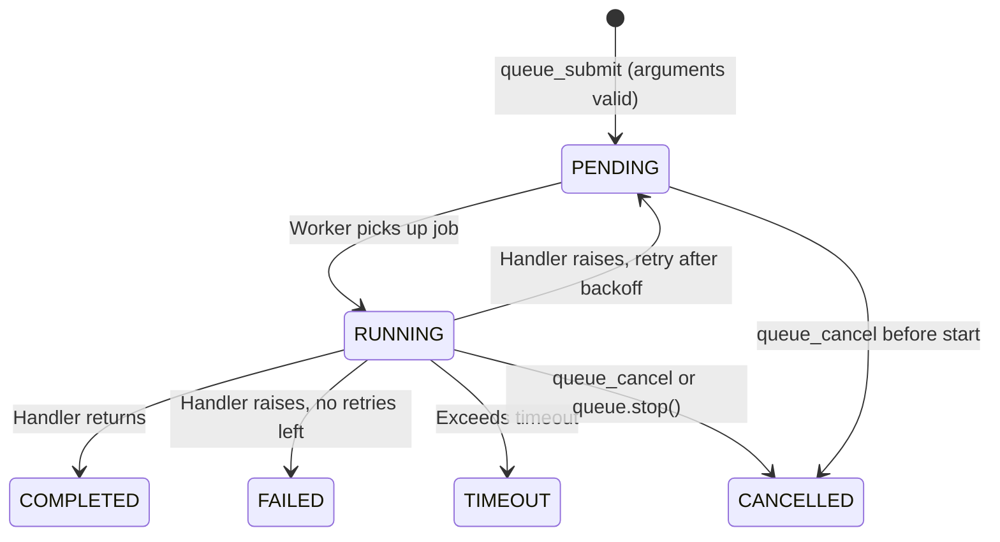

# Queue & Background Jobs

MCP tool calls are synchronous -- the agent sends a request and blocks until the response. This breaks down for long-running work like report generation, data pipelines, or model training. MCPQueue lets server authors define async job types that agents submit and poll for results, turning any long operation into a non-blocking workflow.

## Quick Start

```python
import asyncio

from promptise.mcp.server import MCPServer, MCPQueue

server = MCPServer(name="analytics")
queue = MCPQueue(server, max_workers=4)


@queue.job(name="generate_report", timeout=120)
async def generate_report(department: str) -> dict:
    """Generate a quarterly analytics report."""
    await asyncio.sleep(10)  # Simulate long-running work
    return {"department": department, "rows": 1250, "status": "ready"}


server.run(transport="http", port=8080)
```

MCPQueue auto-registers 5 MCP tools on the server and starts its workers when the server starts. No extra wiring needed.

!!! warning "Jobs live in the server process"
    The built-in backend keeps jobs in memory. A restart loses every job, and replicas behind a load balancer don't share jobs: a client polling a different replica gets `JOB_NOT_FOUND`. See [Durability and replicas](#durability-and-replicas) before you deploy more than one instance.

## How Agents Use It

Once your queue server is running, agents interact through 5 auto-registered tools:

| Tool | Purpose |
|------|---------|
| `queue_submit` | Submit a job -- returns a `job_id` immediately |
| `queue_status` | Check job status and progress |
| `queue_result` | Retrieve a completed job's return value |
| `queue_cancel` | Cancel a pending or running job |
| `queue_list` | List your jobs (filterable by status) |

`queue_submit`'s description lists every registered job type with the JSON Schema of its arguments, and its `job_type` parameter is an enum of those names, so an agent knows what it can submit without guessing:

```
Job types (pass the arguments in `args`):
- generate_report: Generate a quarterly analytics report. args schema: {"additionalProperties":false,"properties":{"department":{"type":"string"}},"required":["department"],"type":"object"}
```

### Typical agent workflow

```
Agent: queue_submit(job_type="generate_report", args={"department": "Engineering"})
  -> {"job_id": "a1b2c3d4", "status": "pending", "job_type": "generate_report"}

Agent: queue_status(job_id="a1b2c3d4")
  -> {"status": "running", "progress": 0.3, "progress_message": "Processing Q3 data"}

Agent: queue_status(job_id="a1b2c3d4")
  -> {"status": "running", "progress": 0.7, "progress_message": "Generating charts"}

Agent: queue_result(job_id="a1b2c3d4")
  -> {"status": "completed", "result": {"department": "Engineering", "rows": 1250}}
```

`progress` is a fraction from `0.0` to `1.0`, not a percentage.

## Defining Job Types

Use the `@queue.job()` decorator to register job types. Works like `@server.tool()` but for background work:

```python
@queue.job(
    name="train_model",       # Job type name (defaults to function name)
    timeout=600,              # Per-job timeout in seconds
    max_retries=2,            # Retry on failure
    backoff_base=2.0,         # Exponential backoff base (2s, 4s, 8s...)
)
async def train_model(dataset: str, epochs: int = 10) -> dict:
    """Train a machine learning model on the given dataset."""
    # Your long-running logic here
    return {"accuracy": 0.95, "model_id": "model-abc123"}
```

The first line of the docstring is the job type's description in `queue_submit`.

### Job arguments

Job handlers receive their arguments as keyword args, matching the `args` dict passed at submission time:

```python
# Agent submits:
queue_submit(job_type="train_model", args={"dataset": "sales-2024", "epochs": 20})

# Handler receives:
async def train_model(dataset: str, epochs: int = 10) -> dict:
    # dataset="sales-2024", epochs=20
    ...
```

Arguments are validated against the handler's signature **when the job is submitted**, the same way tool arguments are: missing or mistyped arguments, and arguments the handler doesn't take, are rejected before a job is created. The error is not retryable:

```
Agent: queue_submit(job_type="train_model", args={"epochs": 20})
  -> {"error": {"code": "INVALID_JOB_ARGUMENTS",
                "message": "Invalid arguments for job type 'train_model': dataset: Field required",
                "retryable": false,
                "suggestion": "Pass `args` matching this schema: {...}"}}
```

Valid values are coerced as for tools (`"20"` becomes `20` for an `int`). A handler that takes `**kwargs` accepts extra arguments; parameters without a type annotation accept any value.

## Progress Reporting

Jobs can report progress so agents can track long operations in real time. Annotate a parameter with `ProgressReporter`:

```python
from promptise.mcp.server import MCPQueue, ProgressReporter

queue = MCPQueue(server)


@queue.job(name="process_data", timeout=300)
async def process_data(
    file_path: str,
    progress: ProgressReporter,
) -> dict:
    """Process a large data file with progress tracking."""
    total_steps = 100
    for step in range(total_steps):
        await asyncio.sleep(0.1)  # Simulate work
        await progress.report(
            step + 1,
            total=total_steps,
            message=f"Processing chunk {step + 1}/{total_steps}",
        )
    return {"rows_processed": 10_000}
```

The reporter is injected automatically (an annotation or a `Depends(ProgressReporter)` default both work) and is not part of the job's arguments. In a job it writes progress onto the job record instead of sending MCP progress notifications -- the call that submitted the job has long returned -- and agents see it via `queue_status`:

```
Agent: queue_status(job_id="xyz")
  -> {"status": "running", "progress": 0.42, "progress_message": "Processing chunk 42/100"}
```

`report(progress, total=...)` stores `progress / total`; without `total`, `progress` itself is taken as the fraction (capped at `1.0`).

## Cancellation

`queue_cancel` works whether or not the job cooperates:

- A **pending** job (including one waiting out a retry backoff) is never started.
- A **running** job's `CancellationToken` is set and its task is cancelled, so a handler that never checks the token still stops at its next `await`. Whatever the handler returns afterwards is discarded: the job stays `cancelled` and has no result.
- A finished job is left as it is (`"message": "Job already finished."`).

Take a `CancellationToken` to see the cancellation inside the handler -- for example to clean up:

```python
from promptise.mcp.server import CancellationToken, ProgressReporter

@queue.job(name="long_computation", timeout=600)
async def long_computation(
    iterations: int,
    progress: ProgressReporter,
    cancel: CancellationToken,
) -> dict:
    """A long computation that supports cancellation."""
    results = []
    try:
        for i in range(iterations):
            cancel.check()  # Raises CancelledError if cancelled
            await asyncio.sleep(0.5)
            results.append(i * i)
            await progress.report(i + 1, total=iterations)
    finally:
        if cancel.is_cancelled:
            await discard_partial_results()
    return {"results": results}
```

By default the task is cancelled immediately. To let cooperative jobs finish their current step and stop on `cancel.check()` themselves, give them a grace period; jobs still running after it are cancelled:

```python
queue = MCPQueue(server, cancel_grace_period=5.0)
```

`queue.stop()` (run on server shutdown) cancels the jobs still running and marks them `cancelled` with `"error": "Queue stopped before the job finished"`.

## Job Ownership

A job belongs to the client that submitted it, and to that client's tenant. `queue_status`, `queue_result`, `queue_cancel` and `queue_list` only show a caller its own jobs; another caller's job is reported as `JOB_NOT_FOUND`, exactly like a job id that doesn't exist, so ids can't be probed.

| Caller | Sees and can cancel |
|--------|---------------------|
| Any client | Its own jobs |
| A client with the admin role (`admin_role`, default `"admin"`) | Every job of its own tenant |
| A client of tenant A, admin or not | Never a job of tenant B (or of no tenant) |

Ownership comes from the authenticated identity -- `ctx.client_id` and `ctx.client.tenant_id`, set by `AuthMiddleware` -- so the queue tools must authenticate. Either build the server with `require_auth=True` (or `require_tenant=True`), or authenticate only the queue tools:

```python
from promptise.mcp.server import APIKeyAuth, AuthMiddleware, MCPQueue, MCPServer

server = MCPServer(name="analytics")
server.add_middleware(AuthMiddleware(APIKeyAuth(keys={
    "sk-alice": {"client_id": "alice", "roles": ["analyst"], "tenant_id": "acme"},
    "sk-ops": {"client_id": "ops", "roles": ["admin"], "tenant_id": "acme"},
})))

queue = MCPQueue(server, auth=True)  # queue tools require a valid key
```

Unauthenticated callers have no identity: on a server where the queue tools don't authenticate, they all share one anonymous owner and see each other's jobs.

Use `admin_role="ops-admin"` to pick a different role, or `admin_role=None` to disable the override. Python code calling the queue directly (`await queue.status(job_id)`) is not restricted; pass `caller=QueueCaller(client_id=..., tenant_id=...)` (from `promptise.mcp.server`) to scope it.

## Job Lifecycle



### Job states

| Status | Description |
|--------|-------------|
| `pending` | Queued, or waiting out a retry backoff |
| `running` | Currently being executed |
| `completed` | Finished successfully with a result |
| `failed` | Handler raised an exception (all retries exhausted) |
| `timeout` | Exceeded the configured timeout |
| `cancelled` | Cancelled via `queue_cancel`, or the queue stopped while it ran |

## Priority Scheduling

Jobs support 4 priority levels. Higher-priority jobs are dequeued first:

```
queue_submit(job_type="generate_report", args={...}, priority="critical")
```

| Priority | Description |
|----------|-------------|
| `critical` | Dequeued first. Emergency or time-sensitive work. |
| `high` | Before normal jobs. Important but not urgent. |
| `normal` | Default priority. |
| `low` | Dequeued last. Background maintenance work. |

## Retry & Backoff

Failed jobs can be retried with exponential backoff:

```python
@queue.job(
    name="send_email",
    max_retries=3,        # Retry up to 3 times
    backoff_base=2.0,     # 2s, 4s, 8s between retries
)
async def send_email(to: str, subject: str, body: str) -> dict:
    """Send an email with retry on transient failures."""
    # If this raises, the job retries after 2s, then 4s, then 8s
    response = await email_client.send(to=to, subject=subject, body=body)
    return {"message_id": response.id}
```

The backoff formula is `backoff_base * 2^(attempt - 1)`:

| Attempt | Delay |
|---------|-------|
| 1 | 2s |
| 2 | 4s |
| 3 | 8s |

During the backoff the job is `pending` with `"error": "Attempt 1 failed: ... Retrying in 2.0s."`. The worker doesn't wait it out -- it moves on to other jobs, and the job is queued again when the backoff ends. Once an attempt succeeds, `error` is cleared. Wrong arguments are never retried: they are rejected when the job is submitted.

## Configuration

### MCPQueue parameters

| Parameter | Type | Default | Description |
|-----------|------|---------|-------------|
| `server` | `MCPServer` | `None` | Server to attach to (auto-registers tools + lifecycle) |
| `backend` | `QueueBackend` | `InMemoryQueueBackend()` | Pluggable storage backend |
| `max_workers` | `int` | `4` | Concurrent worker tasks |
| `default_timeout` | `float` | `300.0` | Default per-job timeout (seconds) |
| `result_ttl` | `float` | `3600.0` | How long completed results are kept (seconds) |
| `cleanup_interval` | `float` | `60.0` | Seconds between cleanup sweeps |
| `tool_prefix` | `str` | `"queue"` | Prefix for auto-registered tool names |
| `auth` | `bool` | `False` | Require authentication on the queue tools (on top of the server's `require_auth`) |
| `admin_role` | `str \| None` | `"admin"` | Role that sees and cancels every job of its own tenant; `None` disables it |
| `cancel_grace_period` | `float` | `0.0` | Seconds a cancelled running job gets to stop on its own before its task is cancelled |

### Custom tool prefix

```python
queue = MCPQueue(server, tool_prefix="jobs")
# Tools: jobs_submit, jobs_status, jobs_result, jobs_cancel, jobs_list
```

## Durability and Replicas

### InMemoryQueueBackend (default)

The only backend Promptise ships. It keeps jobs in a dict and an `asyncio.PriorityQueue` inside the server process:

```python
from promptise.mcp.server import InMemoryQueueBackend

queue = MCPQueue(server, backend=InMemoryQueueBackend(max_size=1000))
```

That means:

- **A restart loses every job** -- pending, running and finished. A client polling a job id from before the restart gets `JOB_NOT_FOUND`.
- **Replicas don't share jobs.** Each replica has its own queue; a job submitted to replica A is `JOB_NOT_FOUND` on replica B.

It fits a single server process, development and tests. With several replicas, route each client to the same replica (sticky sessions) and accept that a restart drops its jobs, or implement a shared backend.

### Custom backend

To share jobs across replicas or keep them across restarts, implement the `QueueBackend` protocol on storage you run (Redis, PostgreSQL, ...). There is no ready-made Redis or database backend in Promptise; this is the interface to write:

```python
from promptise.mcp.server import QueueBackend
from promptise.mcp.server._queue import Job, JobStatus


class MyQueueBackend:  # satisfies QueueBackend
    async def enqueue(self, job: Job) -> None: ...
    async def dequeue(self) -> Job | None: ...   # atomically claim the highest-priority pending job
    async def get(self, job_id: str) -> Job | None: ...
    async def update(self, job: Job) -> None: ...
    async def list_jobs(self, status: JobStatus | None = None, limit: int = 50) -> list[Job]: ...
    async def remove(self, job_id: str) -> bool: ...
    async def count(self, status: JobStatus | None = None) -> int: ...
```

Store every `Job` field, including `owner_client_id` and `owner_tenant_id` -- ownership checks read them -- and make `dequeue` atomic so two replicas never claim the same job. Some state stays in the process that runs a job: a cancel sent to another replica marks the job `cancelled` in storage (and its result is then discarded), but the handler keeps running until it finishes, and retry timers live in the replica that ran the failed attempt.

## Health Check Integration

Add queue health monitoring to an existing `HealthCheck`:

```python
from promptise.mcp.server import MCPServer, MCPQueue, HealthCheck

server = MCPServer(name="analytics")
health = HealthCheck()
health.register_resources(server)

queue = MCPQueue(server)
queue.register_health(health)  # Adds "queue" check (pending < 1000)
```

## Testing with TestClient

`TestClient` calls tools in-process without starting the server, so keep three things in mind:

- **Workers don't start by themselves.** Startup hooks don't run under `TestClient`; call `await queue.start()` (and `await queue.stop()` afterwards), or jobs stay `pending`.
- **`call_tool` returns MCP content**, a list of `TextContent`. Parse the JSON with `json.loads(resp[0].text)`.
- **`TestClient` is not a context manager.** Create it and call it.

```python
import asyncio
import json

import pytest

from promptise.mcp.server import MCPServer, MCPQueue, TestClient


@pytest.fixture
def queue_server():
    srv = MCPServer(name="test")
    queue = MCPQueue(srv, max_workers=2)

    @queue.job(name="add")
    async def add(a: int, b: int) -> int:
        return a + b

    return srv, queue


@pytest.mark.asyncio
async def test_queue_lifecycle(queue_server):
    server, queue = queue_server
    client = TestClient(server)
    await queue.start()  # TestClient doesn't run startup hooks
    try:
        # Submit
        resp = await client.call_tool("queue_submit", {
            "job_type": "add",
            "args": {"a": 2, "b": 3},
        })
        submitted = json.loads(resp[0].text)
        assert submitted["status"] == "pending"
        job_id = submitted["job_id"]

        # Wait for completion
        for _ in range(50):
            resp = await client.call_tool("queue_status", {"job_id": job_id})
            if json.loads(resp[0].text)["status"] == "completed":
                break
            await asyncio.sleep(0.05)

        # Get result
        resp = await client.call_tool("queue_result", {"job_id": job_id})
        assert json.loads(resp[0].text)["result"] == 5
    finally:
        await queue.stop()
```

To test ownership, give each client its own credentials: `TestClient(server, meta={"x-api-key": "sk-alice"})`.

## Complete Example

See `examples/mcp/queue_server.py` in the repository for a full runnable example with progress reporting and cancellation support.
