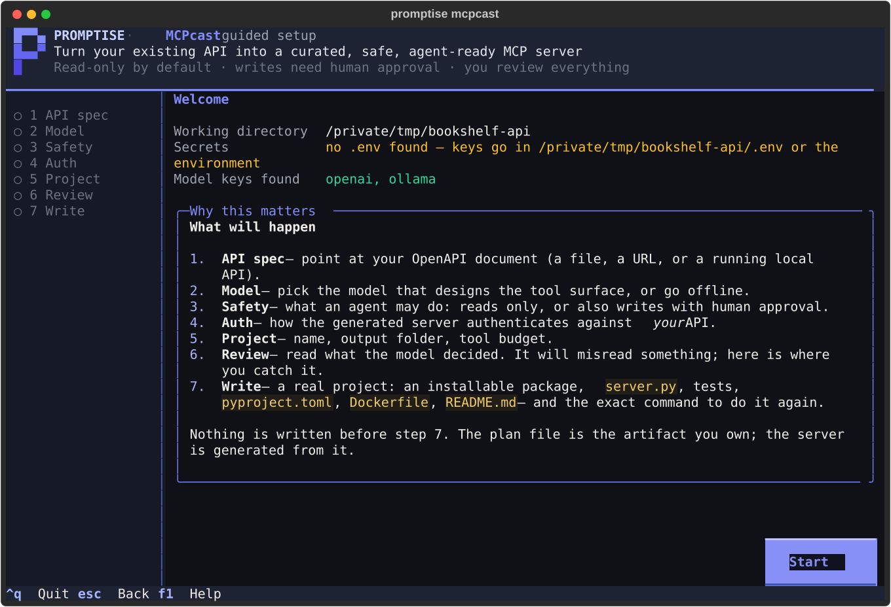
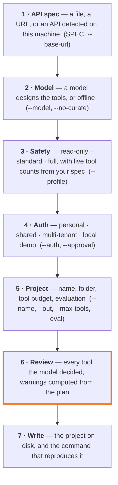
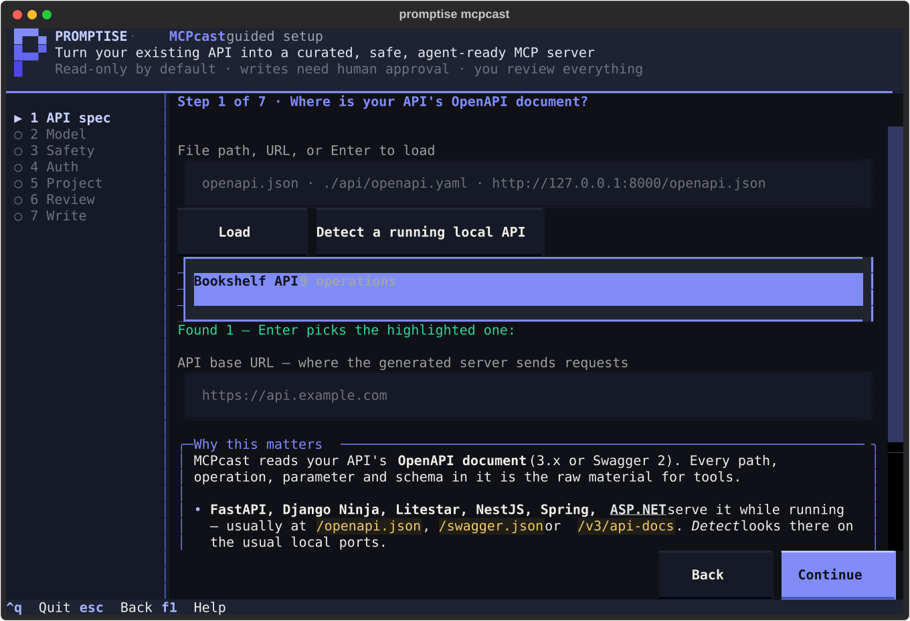
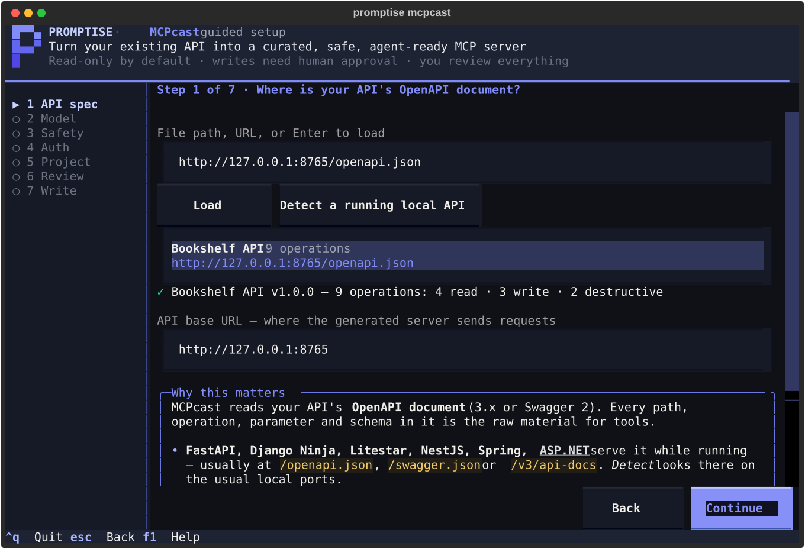
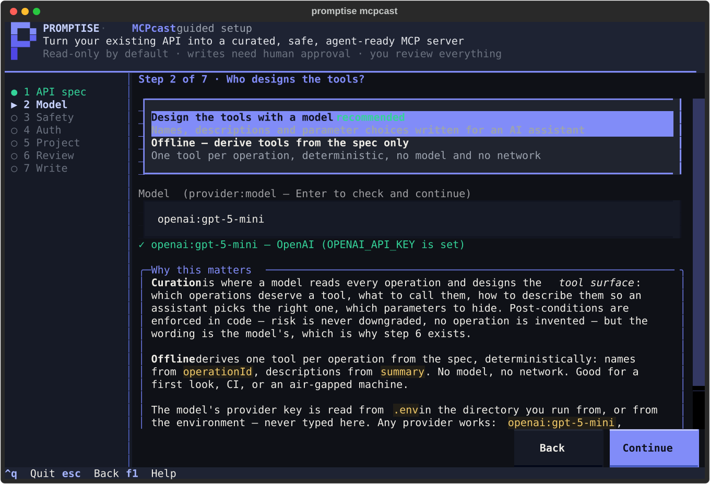
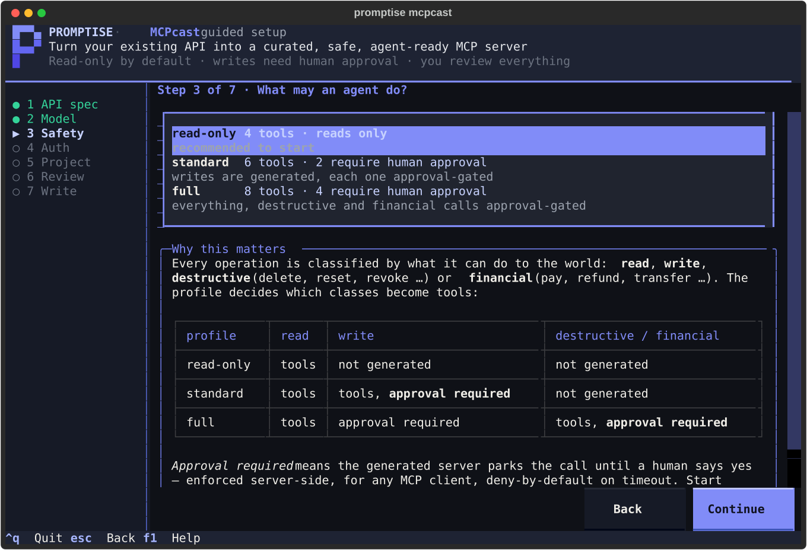
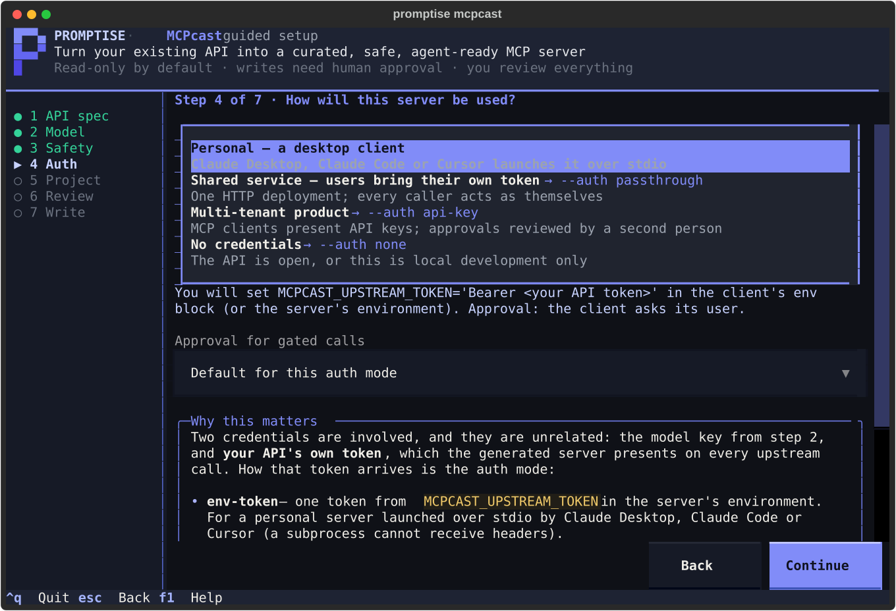
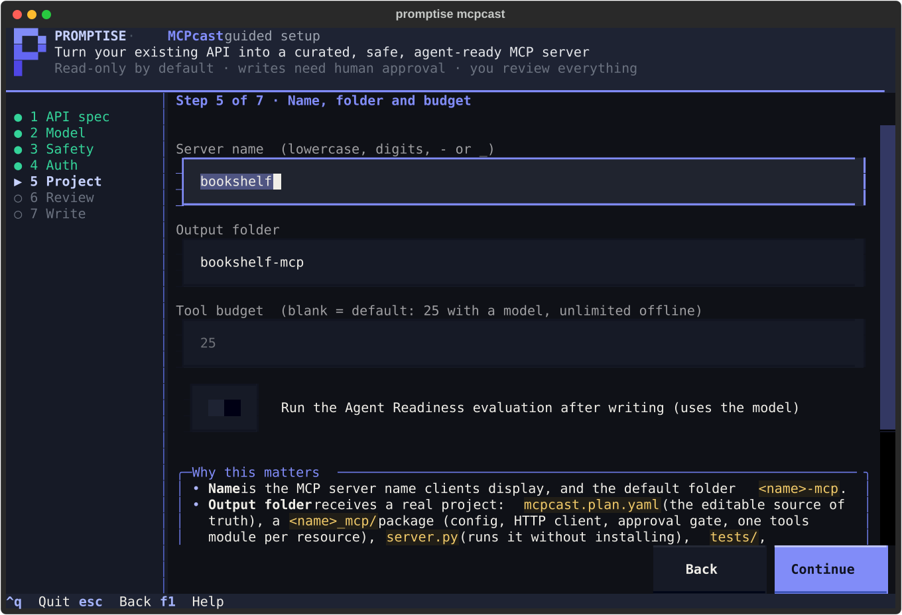
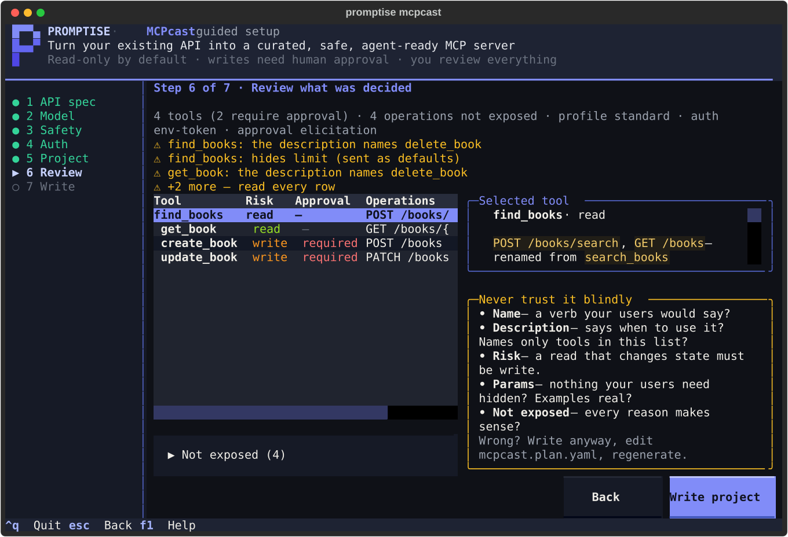
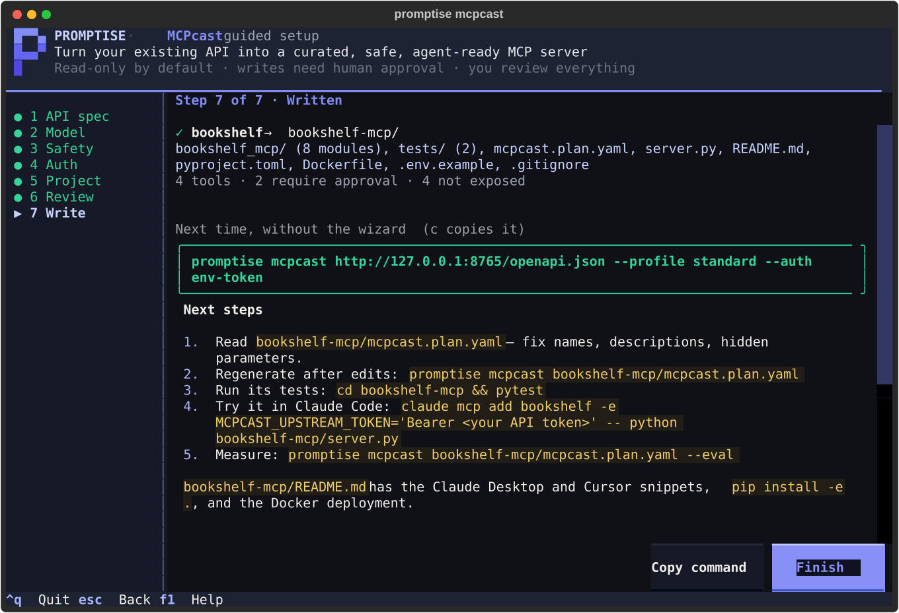

# The guided setup

`promptise mcpcast` with no arguments opens a full-screen terminal wizard. It
asks the seven questions the CLI flags answer, explains each one next to the
choice, shows what the answer means for *your* spec (how many tools each
safety profile would generate, whether the model's key is picked up), lets
you read what the model decided before anything is written, and ends by
printing the exact non-interactive command — so the second run can be a
script.

```bash
promptise mcpcast
```

<figure markdown>
  
  <figcaption>Nothing is written before step 7. The plan file is the artifact you own; the server is generated from it.</figcaption>
</figure>

The welcome screen says which `.env` was loaded. One that cannot be read
(permissions, not UTF-8) is reported there with what to do, and the wizard
goes on without it.

It is the same pipeline as the command line — `load_spec` → `classify` →
`curate` or `build_plan` → `write_project` → `evaluate` — with a different
front. Everything it collects is a `promptise mcpcast` flag; nothing is
possible in the wizard that is impossible on the command line, and vice versa.



!!! tip "Keys"
    `Enter` continues (it confirms the field or menu row you are on), `Esc`
    goes back a step, `Tab` moves between fields, `↑` `↓` move in menus and
    tables, `F1` opens the help, `Ctrl+Q` quits — a spec still downloading
    or a probe still running is abandoned, not waited for; a document
    already being parsed is left to a background thread nothing waits on,
    so the wizard is back at the prompt after the moment it takes the
    parser to hand the interpreter back (a second or two for a 13 MiB YAML
    file, not the whole parse) — nothing is written before step 7; after
    it, the project on disk is reported as usual. The mouse works too. The
    wizard needs a terminal; in CI or a pipe, `promptise mcpcast` refuses
    with the non-interactive form to run instead.

## Step 1 — where is your API's OpenAPI document?

A file path, a URL, or **Detect a running local API**: the wizard probes the
usual local ports (8000, 8080, 8765, 3000, 5000 …) for `/openapi.json`,
`/swagger.json`, `/v3/api-docs` and the other paths frameworks serve their
document at — loopback only, `GET` only, redirects never followed, every
body parsed strictly as JSON or YAML, capped at 5 MiB and held to the same
node budget and nesting depth as a document you type the path of (a local
API `load_spec` would refuse is simply not listed) — and lists what
answers. Probing stops after ten seconds and names the ports it did not
reach. If you start with an empty field it looks straight away.

Whatever the document came from — a file, a URL, a probed port — every
string in it is scrubbed of terminal control characters before anything is
shown: a title or summary carrying an escape sequence cannot erase a review
row or write your clipboard through the wizard.

A URL that carries credentials (`https://user:pass@…` or `?api_key=…`) is
used for the fetch only: the wizard records, shows, copies and prints the
URL *without* them, and says so.

<figure markdown>
  
</figure>

Once loaded you see the title, version and the risk breakdown — how many
operations are `read`, `write`, `destructive` or `financial` — and the **API
base URL** the generated server will send requests to. It comes from the
spec's `servers` block, or from the URL the spec was fetched from; override it
here when the spec is relative or points at the wrong environment (that
becomes `--base-url`). An `mcpcast.plan.yaml` is refused with the regenerate
command to run instead.

<figure markdown>
  
</figure>

## Step 2 — who designs the tools?

**Curation** (a model reads every operation and designs the tool surface) or
**Offline** (one tool per operation, deterministic, `--no-curate`). The model
field takes any provider string — `openai:gpt-5-mini`, `azure:<deployment>`,
`anthropic:claude-sonnet-4.5`, `ollama:llama3` — and is checked *as you type*,
without calling anything: the wizard reports whether the provider's variables
are set, and if not, which variable, where its value lives, and that `.env`
in the working directory is where it goes. You cannot continue with a model
that would fail; Offline is always possible.

<figure markdown>
  
</figure>

The key is read from `.env` or the environment — never typed into the wizard.
[Configuration & Secrets](../getting-started/configuration.md) has every
provider's variables; [Models & Providers](../core/agents/models.md) has the
in-code form.

## Step 3 — what may an agent do?

The three safety profiles, each with the **exact counts your spec would
produce**: the wizard runs the deterministic planner for every profile and
shows how many tools it keeps and how many of them require human approval.
The explanation below the menu is the profile table — read-only exposes reads
only, standard adds writes (approval-gated), full adds destructive and
financial operations (approval-gated).

<figure markdown>
  
</figure>

## Step 4 — how will this server be used?

The question that decides the auth mode. Personal desktop client →
`env-token`; shared service where users bring their own token →
`passthrough`; multi-tenant product → `api-key` with *pending* (four-eyes)
approval; no credentials → `none`. As you move through the options the wizard
shows the environment variable you will set for that mode. The approval mode
can be overridden below the menu; `pending` outside `api-key` is refused with
the reason (a caller must never approve their own request).

<figure markdown>
  
</figure>

The two credentials in play — the model key from step 2 and your API's own
token — are unrelated; [Which keys you need](index.md#which-keys-you-need-and-which-you-dont)
on the end-to-end page spells out both.

## Step 5 — name, folder and budget

The server name (validated: lowercase, digits, `-`, `_`), the output folder
(defaults to `<name>-mcp`, `~` is expanded; a folder that already has files in
it — an mcpcast project *or anything else* — is not written to unless you
switch *overwrite* on, and the switch lists what would be replaced; a
package generated under a previous server name is named too, because
overwriting writes the new package beside it and leaves `pyproject.toml`
and `Dockerfile`, which still ship the old one, to you; regenerate an
existing project from its plan instead to keep edits), the
tool budget (25 with a model, unlimited offline), and whether to run the
[Agent Readiness](index.md#measure-instead-of-guessing) evaluation after
writing (needs the model).

<figure markdown>
  
</figure>

## Step 6 — review what was decided

Curation runs here (a real model call; offline is instant). Then the review
workspace: every tool with its risk class, approval requirement and
operations; the selected tool's full description, parameters, hidden
parameters and example on the right; the operations that were *not* exposed,
each with its reason; and the checklist. Above the table, **computed
warnings** (⚠) point at the two things a model gets wrong most often — a
description that names a tool the plan does not expose, and parameters hidden
from the agent — found by reading the plan, not by asking the model
(`review_warnings()` in the API). Two more come from the generator: a
tool whose description had to be cut to fit what the generated server
sends an agent (shorten the description or example in the plan), and an
upstream base URL that is plain `http://` on a host other than loopback —
the generated server refuses to send the credential there
(`UPSTREAM_INSECURE`), so every call — the evaluation's included — fails
until `MCPCAST_ALLOW_INSECURE_HTTP=1` in its environment accepts the risk
(its own test suite flips that switch for itself, so `pytest` stays green).

Links in a description are the spec's or the model's text: a click opens
`http` and `https` URLs in your browser and refuses anything else
(`ssh://`, a system-preferences pane, a UNC path) with a notice.

<figure markdown>
  
  <figcaption>This is the real proposal <code>openai:gpt-5-mini</code> produced for the bookshelf API. It merged <code>search_books</code> and <code>list_books</code> into <code>find_books</code> — good — and three of its descriptions tell the agent to use <code>delete_book</code>, a tool the standard profile excluded. That is what the checklist is for.</figcaption>
</figure>

!!! danger "Never trust it blindly"
    The model designed this surface and it *will* misread something. Read
    every row: is the name a verb your users would say? Does the description
    say *when* to use the tool, and does it mention only tools that exist in
    this list? Is a `read` really a read? Is anything your users need hidden?
    Does every exclusion reason make sense? Anything wrong: write the project
    anyway, edit `mcpcast.plan.yaml`, regenerate. The plan is yours; the
    server is derived. The [review checklist](index.md#4-never-trust-it-blindly-the-review)
    on the end-to-end page shows the two real fixes for this very API.

Going back (`Esc`) and changing an earlier answer invalidates the plan; the
review rebuilds it when you return. Curation is re-run only when something it
depends on changed. While the rebuild runs — or after it failed — *Write
project* is refused: the previous plan is still in memory, but it was built
for other settings, and writing it would put a project on disk whose profile
or auth mode is not what you chose.

## Step 7 — written

The project is written — `mcpcast.plan.yaml`, the `<name>_mcp/` package, the
`server.py` launcher, `tests/`, `README.md`, `pyproject.toml`, `Dockerfile`,
`.env.example` — and if you asked for it, the Agent Readiness evaluation runs and its grade is shown with the
top fixes. The **equivalent command** is printed — with only the flags that
differ from the defaults — and `c` sends it to the clipboard (OSC 52, which
not every terminal supports). It is printed again, with the
summary, after the wizard exits, so it lands in your scrollback. The
next-step commands below it are quoted for your shell (a folder with a
space in its name pastes correctly, on Windows too), the *Measure* line
carries `MCPCAST_EVAL_AUTHORIZATION` whenever the server presents a
credential — without it a re-run would score the missing token, not the
tool design — and a plain-`http` upstream is warned about here again.

<figure markdown>
  
</figure>

```text
Next time, without the wizard:
  promptise mcpcast http://127.0.0.1:8765/openapi.json --profile standard --auth env-token
```

## Try it: the lab

[Lab: The Guided Setup](../guides/lab-mcpcast-wizard.md) starts a real Helpdesk
API, opens the wizard in your terminal, and — once you have written the project
— proves the result: computed review warnings on what the model wrote, a real
agent over MCP stdio against the live app, a write denied by the approval gate,
and an Agent Readiness Score.

```bash
.venv/bin/python examples/mcp/mcpcast_wizard_lab/run.py
```

## Pre-filling, and running without a terminal

```bash
promptise mcpcast openapi.json --interactive      # the wizard, with step 1 filled in
promptise mcpcast openapi.json -i --base-url https://api.example.com --out mcp/myapi
```

`SPEC`, `--base-url`, `--out`, `--model`, `--eval-tasks` and `--force` pre-fill
the wizard; any other flag (`--profile`, `--auth`, `--approval`, `--name`,
`--max-tools`, `--no-curate`, `--review`, `--yes`, `--eval`, `--serve`,
`--transport`, `--host`, `--port`, `--public`) is refused together with it — choose it
there, or run non-interactively. Without a TTY (CI, a pipe, an editor task) the command
exits with code 1 and the non-interactive form to run:

```text
Error: the guided setup needs an interactive terminal. Pass the spec to run
non-interactively, e.g.  promptise mcpcast openapi.json --no-curate
(promptise mcpcast --help lists every option).
```

## From Python

The wizard is `promptise.mcpcast.wizard`. `run_wizard()` opens it and returns
what it wrote; the plain helpers it is built from — spec loading with
classification, the per-profile preview, local API detection, the equivalent
command — are importable on their own.

```python
from promptise.mcpcast.wizard import run_wizard, detect_local_apis

for api in detect_local_apis():
    print(api.title, api.url, api.operations)

result = run_wizard()
if result:
    print(result.out_dir, result.command)
```

See the [API reference](../api/mcpcast.md#guided-setup) for `MCPcastWizard`,
`WizardResult`, `ParsedSpec`, `preview_profile` and `equivalent_command`.

## See also

- [MCPcast, end to end](index.md) — how MCP works, the real run, the review
  checklist with the two real fixes, Agent Readiness.
- [`promptise mcpcast` CLI reference](../core/cli.md#promptise-mcpcast-generate-an-mcp-server-from-an-api) — every flag the wizard maps onto.
- [Configuration & Secrets](../getting-started/configuration.md) — where the model key goes.
