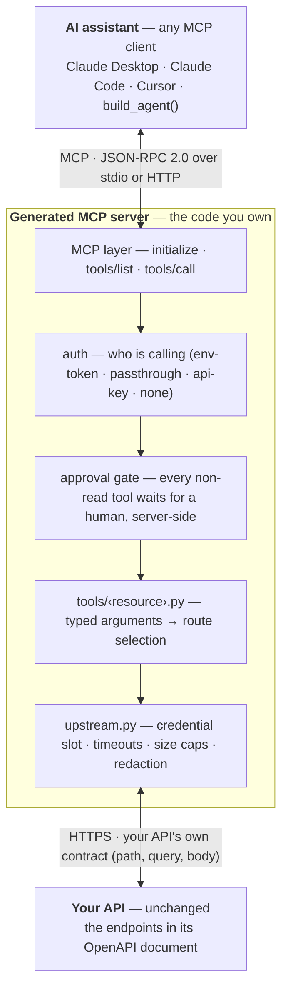
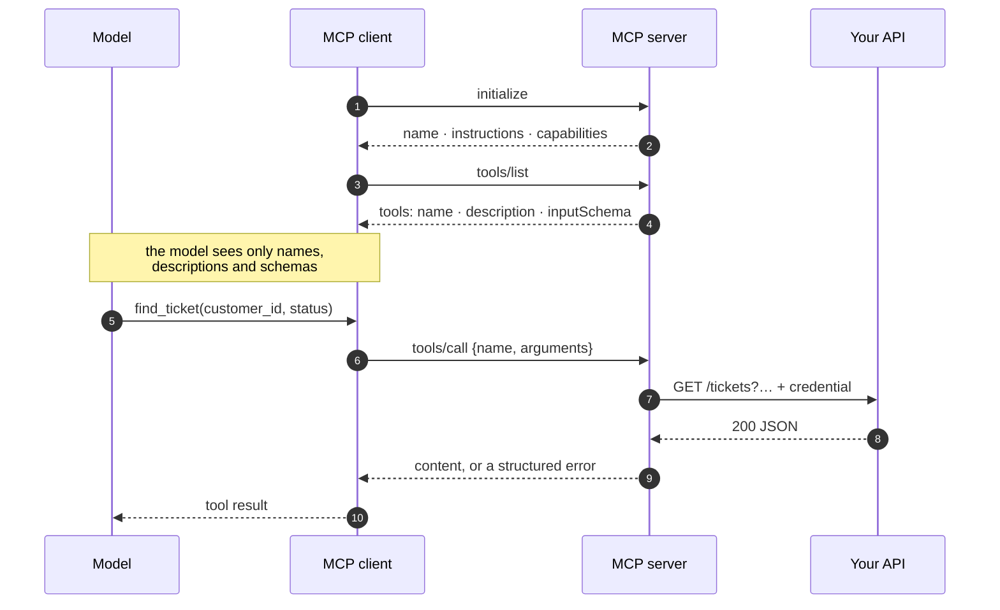
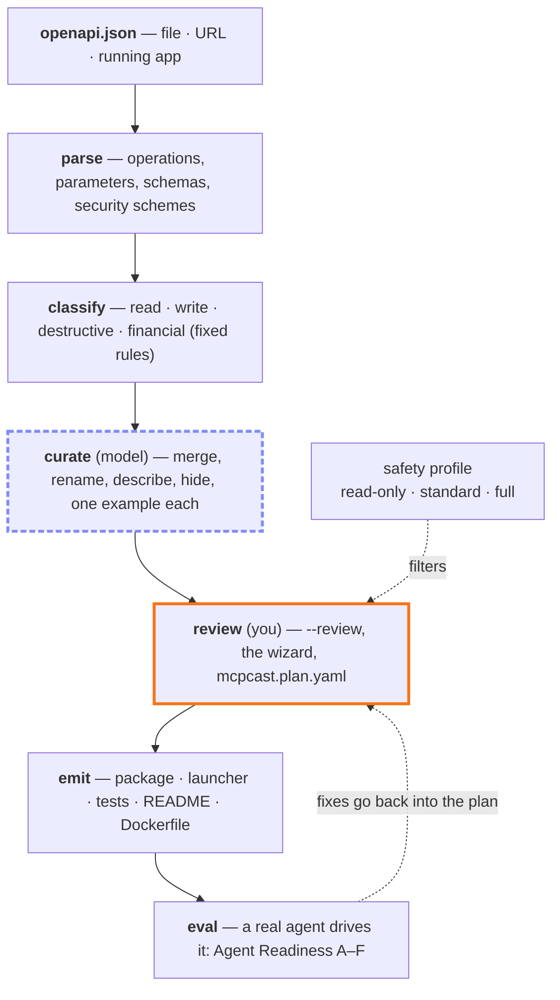
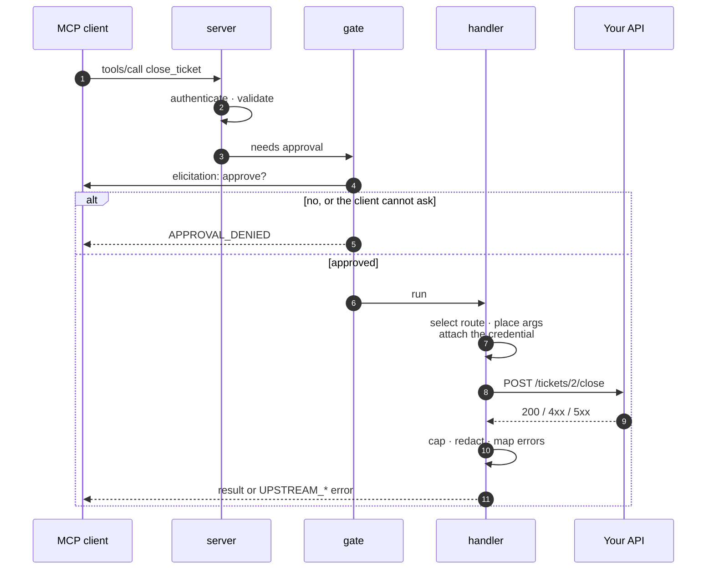
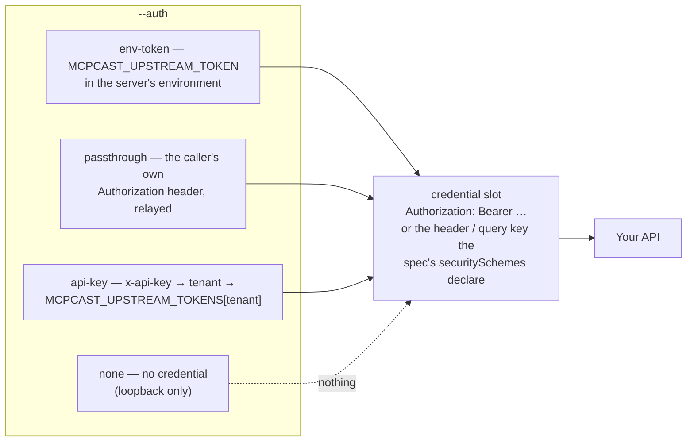

# MCPcast, end to end

You have an API. Your customers have AI assistants — Claude Desktop, Claude
Code, Cursor, agents of their own. MCPcast makes the first usable by the
second: it reads the API's OpenAPI document, designs a *small* set of tools
an AI can use correctly, and writes an MCP server you can read, edit and
ship. Read-only by default; anything that changes data is only generated when
you opt in, and then demands human approval enforced by the server.

This page is the whole story on one page: how MCP works, what MCPcast
generates, a real run from a running Python API to an agent driving it, and
— the part that matters most — **how to review what the model did**, because
it designs the tool surface and it *will* misread something.

!!! danger "Never trust it blindly"
    Curation is done by a language model. In the run below it wrote two tool
    descriptions that tell the agent to use `delete_book` — a tool it had
    itself excluded from the plan — and hid a parameter your users need.
    Both were one-line fixes in the plan file, *after a human read it*. The
    plan is the artifact you own; the server is generated from it. Review
    the plan, fix it, regenerate, measure. Every time.

!!! tip "Prefer to be walked through it?"
    `promptise mcpcast` with no arguments opens the [guided setup](guided-setup.md):
    a full-screen terminal wizard that asks the seven questions below, explains
    each one, detects an API running on your machine, shows the tool counts each
    safety profile would produce from your spec, and ends with the exact command
    it ran. Everything on this page applies to it — including the review.

## The picture

Two protocols, one generated server in the middle. The assistant speaks MCP
to the server; the server speaks your API's own HTTP to the upstream — with
the credential, the approval gate and the routing living in code you can read.



Nothing changes on the API side. What MCPcast adds is the box in the middle,
generated from the OpenAPI document and owned by you through
`mcpcast.plan.yaml`.

## Which keys you need (and which you don't)

Two unrelated credentials show up in an MCPcast project. Be exact about
which is which:

| Step | Needs | Where it goes |
|---|---|---|
| **Generating** the server — `promptise mcpcast openapi.json` | A key for the **curation model**, the LLM that designs the tool surface. The default is `openai:gpt-5-mini`, so `OPENAI_API_KEY`; `--model <provider>:<model>` switches to anything in the [provider table](../getting-started/configuration.md#every-providers-variables). **With `--no-curate` no key is needed at all** — the plan is derived deterministically from the spec, fully offline. | `.env` in the directory you run from, or the environment — [Configuration & Secrets](../getting-started/configuration.md) explains both. `promptise models check openai:gpt-5-mini` tells you whether it is picked up. |
| `--eval` (Agent Readiness) | The same model key — it runs a real agent over the server. If your API needs auth, also `MCPCAST_EVAL_AUTHORIZATION='Bearer <token>'` so the live reads reach it. `--review` needs nothing extra. | Same. |
| The **generated server** calling **your API** | Your API's own credential — nothing to do with any LLM. `--auth` decides how it arrives: `passthrough` forwards each caller's `Authorization` header (HTTP transport only); `env-token` reads one `MCPCAST_UPSTREAM_TOKEN='Bearer …'` from the server's environment (the mode for stdio/desktop clients; binds loopback only unless `--public`); `api-key` authenticates MCP clients with `MCPCAST_CLIENT_KEYS` and maps each tenant to an upstream token in `MCPCAST_UPSTREAM_TOKENS`; `none` sends nothing and refuses to bind to anything but loopback. | The client's `env` block (Claude Desktop / Claude Code / Cursor) or the server's environment (HTTP). Never in `mcpcast.plan.yaml` or `server.py` — the generated code only *reads* it. |

The generated server itself **never calls a model**. It is plain code:
validate the arguments, call your API over HTTP, return the result. The AI is
on the other side of the MCP connection — Claude Desktop, Cursor, or an agent
you build with `build_agent()` — and brings its own model key.

---

## 1. How an MCP server actually works

The Model Context Protocol is JSON-RPC 2.0 over a transport. There are three
things a client ever does with a server:

| Step | The client sends | The server answers |
|---|---|---|
| **initialize** | its protocol version and capabilities | its name, version, `instructions` for the model, and capabilities |
| **tools/list** | nothing | a list of tools: `name`, `description`, `inputSchema` (JSON Schema for the arguments) |
| **tools/call** | `name` + `arguments` | `content` (usually text) or an error |



That is the entire contract an AI assistant relies on. When you add a server
to Claude Desktop, Claude Desktop launches it, calls `initialize` and
`tools/list`, and shows the model the tool names, descriptions and schemas.
**The description is the only thing the model reads to decide when to call a
tool and how** — which is why MCPcast rewrites descriptions for a model
rather than copying the API's developer docs, and why you will review them.

Two transports matter:

- **stdio** — the client starts the server as a subprocess and talks over
  stdin/stdout. This is how desktop clients work. Nothing else may be written
  to stdout, and the subprocess cannot receive HTTP headers — which is why a
  personal stdio server carries its upstream credential in its own
  environment (`--auth env-token`).
- **HTTP / SSE** — the server listens on a port; clients connect with
  headers. This is how a shared deployment works, and where per-user tokens
  (`--auth passthrough`) or per-tenant keys (`--auth api-key`) live.

A generated MCPcast server speaks both: `python server.py` is stdio,
`python server.py --transport http` listens on `http://127.0.0.1:8080/mcp`.

## 2. What MCPcast generates, and how the server works



Code does the deterministic work (plain boxes), a model designs the surface
(dashed indigo outline) under post-conditions code enforces, and **you** own
the plan (orange outline): everything downstream is regenerated from it.

| Stage | What happens | Who decides |
|---|---|---|
| **parse** | Every operation with its method, path, parameters (and where each travels: path, query, body), schemas, scopes, `deprecated` | code |
| **classify** | Each operation gets a risk class from fixed rules: `read`, `write`, `destructive`, `financial` — with escalation for admin scopes, admin/internal paths, deprecated, and reads that name a destructive verb | code |
| **curate** | A model designs the surface: budget, drop what an agent has no business calling, collapse redundant routes into one intent tool, rename in domain language, rewrite descriptions for a model, hide rarely needed parameters behind defaults, write one example per tool | **model** — checked by code: no unknown operations, nothing both kept and dropped, valid names, and **risk may be raised but never lowered** |
| **review** | `--review` prints the kept and not-exposed tables and waits for a yes | **you** |
| **emit** | a real project: `mcpcast.plan.yaml` (the source of truth), a `<name>_mcp/` package, `server.py` (launcher), `tests/`, `pyproject.toml`, `Dockerfile`, `README.md` | code |
| **eval** | A real agent drives the server on generated tasks; Agent Readiness Score A–F with specific fixes | code + model |

The **safety profile** is applied *after* curation and enforced by the plan
schema itself: `read-only` (default) generates reads only; `standard` adds
writes; `full` adds destructive and financial operations — and every non-read
tool is `requires_approval=True`, gated server-side for any client.

### Anatomy of the generated project

It is a package you could have written by hand — installable, testable,
deployable — and it depends only on `promptise` and `httpx`. From the run
below:

```text
bookshelf-mcp/
├── mcpcast.plan.yaml        # the source of truth — the only file you edit
├── server.py                # launcher: python server.py; promptise serve server:server
├── pyproject.toml           # pip install -e .  →  the `bookshelf-mcp` command
├── README.md                # install snippets, layout, configuration
├── .env.example  Dockerfile  .gitignore
├── bookshelf_mcp/
│   ├── __init__.py          # build_server(), __version__
│   ├── __main__.py          # python -m bookshelf_mcp [--transport http]
│   ├── config.py            # constants from the plan + the MCPCAST_* environment
│   ├── upstream.py          # the HTTP client: Route, select_route, Upstream
│   ├── approval.py          # the human approval gate
│   ├── server.py            # build_server(): where the pieces meet
│   └── tools/
│       ├── __init__.py      # register_all()
│       └── books.py         # every @server.tool for /books, with its ROUTES
└── tests/
    ├── conftest.py          # a fake upstream, clients through the full pipeline
    └── test_tools.py        # per tool: listed, routed correctly, gated
```

Everything under `bookshelf_mcp/`, `server.py`, `tests/` and `README.md` is
*derived* — rewritten from the plan on every regeneration. Under `tools/`
the generated header decides ownership: a generated module the plan no
longer has is removed; a file without the header — hand-written, or a copy
of a generated module you renamed and kept — is yours and stays, and if the
plan would now write a module at its path, regeneration refuses (nothing is
written) until you rename it or pass `--force`. `pyproject.toml`,
`Dockerfile`, `.env.example` and `.gitignore` are scaffold: written once,
then yours — which is why `api.name` is fixed after the first write: it
names the package (`bookshelf_mcp/`) and the `bookshelf-mcp` command those
files package and ship, so a renamed plan is refused until the old package,
`pyproject.toml` and `Dockerfile` are removed (or it goes to a new `--out`).

```python
# bookshelf_mcp/tools/books.py
ROUTES: dict[str, tuple[Route, ...]] = {
    "find_books": (
        Route("GET", "/books/{book_id}", path_params=("book_id",), required=("book_id",)),
        Route(
            "POST",
            "/books/search",
            body_params=("query", "author", "limit"),
            required=("query",),
        ),
        Route("GET", "/books", query_params=("author", "limit")),
    ),
    ...
}
```

- **`tools/<resource>.py`** — one module per resource (from the tool's tag,
  else the first path segment). `ROUTES` holds each tool's upstream operations;
  a tool with several routes dispatches to the *first* route whose required
  arguments were supplied: `find_books(book_id=3)` → `GET /books/3`;
  `find_books(query="dune")` → `POST /books/search`; `find_books()` →
  `GET /books`. Order matters, and the plan schema refuses an order in which
  a route could never be reached. `register(server, upstream)` declares the
  tools with `@server.tool(...)` and the MCP annotation hints
  (`read_only_hint`, `destructive_hint`, `requires_approval`).
- **`upstream.py`** — `Upstream.call` builds the HTTP request: path values
  must be a single real segment (an empty value or `..` is rejected rather
  than reaching a neighbouring endpoint), `None` optionals are omitted, form
  bodies and `deepObject` query values are bracket-encoded, and every failure
  comes back as a structured error the agent can act on
  (`UPSTREAM_AUTH_MISSING`, `UPSTREAM_TIMEOUT`, `UPSTREAM_UNREACHABLE`, `UPSTREAM_ERROR` with the
  status). The credential for the auth mode is added here.
- **`approval.py`** — installs `ApprovalGateMiddleware` when any tool is
  gated, with the plan's approver (elicitation, or the tenant-scoped pending
  store under `api-key`). Nothing is installed for a read-only plan.
- **`server.py`** (in the package) — `build_server()` assembles it: the
  `MCPServer`, `AuthMiddleware` under `api-key`, the gate, every tools module.
  It takes `approval_handler=` and `http_client=` so the generated tests and
  the evaluation can inject an approver and a fake upstream.
- **`__main__.py`** — `--transport stdio|http|sse`, `--host`, `--port`; an
  `--auth none` or `--auth env-token` server refuses to bind to a non-loopback
  address unless `--public` (or `MCPCAST_PUBLIC=1`). The root `server.py` runs
  the same thing without installing the package.
- **`tests/`** — a pytest suite through the full server pipeline: every tool
  is listed, every tool reaches the right method and path on a fake upstream,
  and every gated tool is denied when the human says no — with nothing
  reaching the API. `cd bookshelf-mcp && pytest`.

The **approval gate** is a middleware in the server's request pipeline, so it
applies to every MCP client, not only Promptise agents. Under stdio the
default approver asks the human behind the client through MCP *elicitation*;
a client that cannot elicit gets `APPROVAL_DENIED` — fail-closed, never
silently allowed. You will see exactly that below.

### The life of one call

What happens between `tools/call` arriving and your API answering — here for
a gated write, which is the interesting case:



Where the credential in step 8 comes from is the auth mode you chose (the *server* is the MCP layer plus auth middleware, the *handler* is `tools/<resource>.py` plus `upstream.py`):



Every generated project passes `ruff`, `ruff format --check`, `mypy` and its
own tests — for hostile specs too — and the plan is the only file you edit.

---

## 3. The real run: a Python API becomes an MCP server

Everything in this section was run, and the output is pasted verbatim. The
API is `examples/mcp/mcpcast_fastapi_app/app.py` — an ordinary FastAPI
"bookshelf" with a bearer token, nine endpoints and an admin corner. Nothing
in it knows about MCP.

### 3.1 Start the API

```bash
cd examples/mcp/mcpcast_fastapi_app
uvicorn app:app --port 8765
```

```text
INFO:     Uvicorn running on http://127.0.0.1:8765 (Press CTRL+C to quit)
```

It is protected, and it already serves the one document MCPcast needs:

```text
$ curl -s http://127.0.0.1:8765/books
{"detail":"Not authenticated"}
$ curl -s -H "Authorization: Bearer demo-token" http://127.0.0.1:8765/books | python -c "..."
6 books; first: Dune — Frank Herbert
$ curl -s http://127.0.0.1:8765/openapi.json | python -c "..."
Bookshelf API | servers: None | operations: ['create_book', 'delete_book', 'find_books_legacy',
'get_book', 'health_check', 'list_books', 'reset_catalogue', 'search_books', 'update_book']
```

No `servers` block — FastAPI omits it — so MCPcast will use the spec URL's
origin as the API base URL.

### 3.2 Generate the MCP server

Reads plus approval-gated writes, credentials suited to a desktop client, a
model designing the surface, and a review table before anything is written:

```bash
promptise mcpcast http://127.0.0.1:8765/openapi.json \
  --profile standard --auth env-token --name bookshelf --review --yes \
  --output bookshelf-mcp
```

```text
Parsed 9 operations from http://127.0.0.1:8765/openapi.json; profile=standard auth=env-token
Curating with openai:gpt-5-mini (budget 25 tools)…
```

What the model designed, straight from `bookshelf-mcp/mcpcast.plan.yaml`:

```text
api: bookshelf  base_url: http://127.0.0.1:8765  auth: env-token  profile: standard

find_books       read   —         GET /books/{book_id} | POST /books/search | GET /books
                 params: book_id, query, author, limit
                 Fetch books from the catalogue. Use this to get a single book by id (provide book_id),
                 to do a full-text search (provide query), or to list books (no required parameters)...
add_book         write  APPROVAL  POST /books
                 params: title, author, year
                 Add a new book to the catalogue. Supply title, author and year; tags are optional...
update_book      write  APPROVAL  PATCH /books/{book_id}
                 params: book_id, notes, tags, year
                 Modify one or more fields on an existing book. Provide book_id and any of notes, tags,
                 or year; only the fields you send will be changed...

not exposed:
  health_check       Service liveness probe for load balancers/ops; not useful for an end-user agent.
  find_books_legacy  Deprecated legacy endpoint; use search_books (POST /books/search) instead.
  reset_catalogue    Admin-only destructive operation that resets the entire dataset; not appropriate
                     for general agents.
  delete_book        destructive operation excluded by profile 'standard'
```

Nine endpoints became **three intent tools**. The model collapsed
`get_book` + `search_books` + `list_books` into one `find_books` with three
routes, rewrote every description for a model, and left out the health check,
the deprecated endpoint and the admin reset with its own reasons. The code
enforced what the model may not decide: `delete_book` stays out under
`standard`, and both writes are approval-gated.

### 3.3 Prove it is a real MCP server

Speak MCP to it over stdio — `initialize`, `tools/list` — exactly as a desktop
client would. The upstream token travels in the server's environment:

```bash
promptise list-tools --model-id openai:gpt-5-mini \
  --stdio "name=bookshelf command=python args='bookshelf-mcp/server.py' env.MCPCAST_UPSTREAM_TOKEN='Bearer demo-token'"
```

```text
┃ Tool        ┃ Description                                                          ┃ Input Schema
│ find_books  │ Fetch books from the catalogue. Use this to get a single book by id  │ { "properties": {
│             │ (provide book_id), to do a full-text search (provide query), or to   │   "book_id": {...},
│             │ list books (no required parameters). ...                             │   "query": {...},
│             │                                                                      │   "author": {...},
│             │ Parameters:                                                          │   "limit": {...} },
│             │   - book_id (integer): Integer id of the book. ...                   │   "type": "object" }
│             │   - query (string): Full-text search string matched case-insensitively
│             │   - author (string): Exact author name to filter results. ...
│             │   - limit (integer): Maximum number of results to return. ...; default 10
│             │ Provide one of: book_id | query | (no parameters)
│             │ Example: {"query": "hobbit", "limit": 5}
│ add_book    │ Add a new book to the catalogue. ...                                 │ required: title, author, year
│ update_book │ Modify one or more fields on an existing book. ...                   │ required: book_id
```

That table *is* what the model will see: the description block — prose,
parameter notes, dispatch rule, example — and the JSON Schema.

### 3.4 An agent uses your API

An interactive agent, connected over real MCP stdio to the generated server,
which calls the running FastAPI app with the bearer token:

```bash
promptise run --model-id openai:gpt-5-mini --trace \
  --stdio "name=bookshelf command=python args='bookshelf-mcp/server.py' env.MCPCAST_UPSTREAM_TOKEN='Bearer demo-token'"
```

A read, end to end:

```text
> Which books do we have by Le Guin?
→ Invoking tool: find_books with {'book_id': None, 'query': 'Le Guin', 'author': None, 'limit': 20}
✔ Tool result from find_books: [{"id": 1, "title": "A Wizard of Earthsea", "author": "Ursula K. Le Guin", ...},
  {"id": 2, "title": "The Left Hand of Darkness", ...}, {"id": 3, "title": "The Dispossessed", ...}]
╭──────────────── Final LLM Answer ────────────────╮
│ We have the following books by Ursula K. Le Guin: │
│ - id 1 — A Wizard of Earthsea (1968)              │
│ - id 2 — The Left Hand of Darkness (1969)         │
│ - id 3 — The Dispossessed (1974)                  │
╰───────────────────────────────────────────────────╯
```

The API's own log shows the request the agent caused — `POST /books/search`,
the route `find_books` dispatched to because `query` was supplied:

```text
INFO:     127.0.0.1:55098 - "POST /books/search HTTP/1.1" 200 OK
```

### 3.5 The gate stops a write

```text
> Add "The Left Hand of Darkness" by Ursula K. Le Guin, published 1969.
→ Invoking tool: add_book with {'title': 'The Left Hand of Darkness', 'author': 'Ursula K. Le Guin', 'year': 1969}
✔ Tool result from add_book: {
  "error": {
    "code": "APPROVAL_DENIED",
    "message": "Approval denied for tool 'add_book': client declined or returned an invalid elicitation response",
    "retryable": false,
    "details": { "approval_request_id": "4801664d08da2bc9c7d0e8eef5cecee7", "reviewer_id": "elicitation" }
  }
}
```

The agent chose the right tool with the right arguments, the server's
approval gate held the call, no human could be asked over this stdio client,
and the call was **denied** — no `POST /books` appears in the API log. That
is the safety profile working as designed. With a client that supports MCP
elicitation the human would have been asked; with `--auth api-key` a second
person holding the `approver` role would decide through the four-eyes tools.
Under `read-only` the write tools would not exist at all.

### 3.6 Connect a real assistant

The generated `README.md` carries the snippets for each client, with the
credential already in the client's own environment block (a desktop client
launched from the dock never sees your shell):

```json
{
  "mcpServers": {
    "bookshelf": { "command": "python", "args": ["/absolute/path/to/server.py"],
                   "env": {"MCPCAST_UPSTREAM_TOKEN": "Bearer demo-token"} }
  }
}
```

```bash
claude mcp add bookshelf -e MCPCAST_UPSTREAM_TOKEN="Bearer demo-token" -- python /absolute/path/to/server.py
```

---

## 4. Never trust it blindly — the review

The model designs the tool surface. It reads your summaries and descriptions,
guesses intent from names, and decides what to merge, hide and drop. It is
good at this, and it is wrong often enough that shipping the plan unread is
negligent. Here is what it got wrong in the run above, found by reading the
plan and the `list-tools` output — and this was a nine-endpoint API.

### What it got wrong this time

**It told the agent to use a tool that does not exist.** Two descriptions
ended with *"…or to remove them (use delete_book)"* — but the model had
itself dropped `delete_book` (correctly: the profile excludes it). An agent
reading that will look for `delete_book`, not find it, and either apologise
or, worse, try `update_book` creatively. Fix, in the plan:

```yaml
- name: update_book
  description: >-
    Modify one or more fields on an existing book. ...
    Do not use this to create books (use add_book). Deleting is not available through this server.
```

**It hid a parameter your users need.** `add_book` came out with `tags`
hidden and `Always sends: tags=[]` — a "param diet" decision that is right
for a rarely used flag and wrong for a field people fill in on every create.
Fix: delete `hidden: true` (and the default) under that parameter in the
plan.

Then regenerate — the plan is untouched; the package, `server.py`, `tests/`
and `README.md` are rewritten:

```bash
promptise mcpcast bookshelf-mcp/mcpcast.plan.yaml
```

```text
bookshelf_mcp/tools/books.py: delete_book in tool descriptions -> 0;  tags (array): Optional list of tags to attach to the book.
```

### The checklist

Read the plan top to bottom, then the `list-tools` view (what the model will
actually see), and ask:

| Look at | The question | Typical misread |
|---|---|---|
| **`dropped`** | Is anything here that an end user's agent genuinely needs? | The model drops "internal-looking" names that are the product's main feature; a deprecated-but-only endpoint |
| **Risk class** | Does every `write` really only write? Is every `read` free of side effects? | A `POST /reports/generate` that also emails; a `GET /export` that bills; classification comes from names, so a misleading summary misleads it — you may raise a class in the plan, never lower it |
| **Collapsed tools** | Do the merged routes really serve one intent, and does the dispatch (first route whose required parameters were supplied) pick the route a user would expect? | Merging "get by id" with "delete by id" is refused by the code; merging search with list is usually right; merging two writes with different side effects is usually wrong |
| **Descriptions** | Do they say *when* to use the tool, *when not*, and *what comes back* — in the product's words? Do they reference only tools that exist? | Pointing at excluded tools (above); jargon copied from the spec; "returns a list" for something paginated |
| **Hidden parameters** | Is every hidden default something the agent should never change? | Hiding `tags`, `currency`, `notify`, `dry_run=false` — anything with business meaning |
| **Examples** | Do the example values exist in your data? | Invented ids (`ORD-1007`, `CUST-42`) teach both the task writer and the agent to call the API with identifiers it does not recognise — the readiness eval reports these |
| **Names** | Would a user say this? | `post_books_search` vs `find_books`; a rename that collides with a competitor's meaning |
| **Required vs optional** | On a collapsed tool, is anything required that only one route needs? | A parameter left required would make the other routes unreachable — the code refuses unreachable orders, but it cannot know which optional you *meant* |

Everything on the list is a plain edit in `mcpcast.plan.yaml`. Nothing
requires touching the generated package; you never should — it is regenerated.

### Measure instead of guessing

`--eval` has a real agent attempt generated tasks against the server (reads
may hit your live API; writes hit spec-derived mocks behind an auto-approver,
so nothing changes) and grades the surface A–F with specific fixes. The run
on the reviewed plan:

```bash
MCPCAST_UPSTREAM_TOKEN="Bearer demo-token" promptise mcpcast bookshelf-mcp/mcpcast.plan.yaml --eval --eval-tasks 12
```

```text
Evaluating with openai:gpt-5-mini (12 tasks)…
Agent Readiness: A  (11/12 tasks succeeded)
  ✗ `find_books` called the API with identifiers it does not recognise — the example in the plan
    teaches both the task writer and the agent, so replace those example values with ones that exist
```

The one failure, from `eval/report.md`:

```text
| t2 | Show me the book record for book id 42. | `find_books` | find_books ✗ | ✗ |
```

There is no book 42. The model's own example for `update_book` says
`{"book_id": 42, ...}`; the task writer learned "42" from it, the agent
called `GET /books/42`, the API said 404. An invented identifier in an
example is exactly the kind of thing that reads fine and fails in
production — and it took the evaluation ten seconds to find. The fix is the
example in the plan; then regenerate and re-score.

The score varies between runs — treat it as a floor to assert in CI, not a
number to chase:

```python
# tests/test_mcp_surface.py — the tool surface cannot rot without a failing test
from promptise.mcpcast import MCPcastPlan

def test_plan_is_what_we_shipped():
    plan = MCPcastPlan.load("bookshelf-mcp/mcpcast.plan.yaml")
    assert plan.tool_names == ["find_books", "add_book", "update_book"]
    assert {t.name for t in plan.gated_tools} == {"add_book", "update_book"}
    assert not any("delete_book" in t.description for t in plan.tools)
    assert not plan.tool("add_book").params["tags"].hidden
```

---

## 5. Improving what it generated

- **Give the model better input.** `summary=`, `operation_id=` and
  `Field(description=...)` in your own code become the tool description, the
  tool name and the parameter notes. Ten minutes on those pays back in every
  agent conversation — see [Make Your Python API MCP-Ready](../guides/mcpcast-python-app.md).
- **Tune the budget.** `--max-tools` is the strongest lever: 25 by default,
  smaller for a focused product, larger for a platform. `--no-curate` gives
  the deterministic one-tool-per-operation plan when you would rather merge
  by hand.
- **Rewrite descriptions like prompts.** What it does, when to use it, when
  not, what comes back, and which tool to use instead. Mention related tools
  by name — real ones.
- **Put real identifiers in examples.** The example is a teaching sample for
  the agent; make it a call that works against your data.
- **Prefer intent tools over routes.** If two routes always serve the same
  user goal, collapse them; if one route serves two goals, split it into two
  tools with different descriptions (the same operation may only appear once,
  so the second tool needs its own operation — or a clearer description).
- **Re-run `--eval` after every change** and keep the report in the repo next
  to the plan.

## 6. Ship it

| Deployment | Auth | Approval | Run |
|---|---|---|---|
| Personal, desktop client | `--auth env-token` (`MCPCAST_UPSTREAM_TOKEN` in the client's env block) | elicitation (the client asks its user) | `python server.py` — loopback only: with one shared credential and no caller authentication it refuses a public bind unless you pass `--public` behind an authenticating gateway |
| Shared, each user acts as themselves | `--auth passthrough` (the caller's `Authorization: Bearer …` header is forwarded) | elicitation | `python server.py --transport http` **behind your gateway** — the server is a relay for whatever header reaches it |
| Multi-tenant product | `--auth api-key` (`MCPCAST_CLIENT_KEYS`, per-tenant `MCPCAST_UPSTREAM_TOKENS`) | `pending` — four-eyes review by a second person of the same tenant | `promptise serve server:server -t http --port 8080` (or `docker build .`); the server authenticates its callers itself |

Keep `bookshelf-mcp/` in your repository next to the API, regenerate from
the plan in CI when the spec changes, and let the readiness score be the
release gate. The environment variables the server reads are listed in its
README (`MCPCAST_BASE_URL`, `MCPCAST_TIMEOUT`, `MCPCAST_APPROVAL_TIMEOUT`, and
the auth-mode ones).

---

## Where to go next

- [MCPcast reference](../mcp/server/mcpcast.md) — every flag, profile, auth and approval mode, the readiness score in detail
- [Step-by-step guide](../guides/mcpcast-existing-api.md) — twelve steps from a spec file to a shipped server, with real output at each
- [Make Your Python API MCP-Ready](../guides/mcpcast-python-app.md) — FastAPI, Django, Flask: get the spec, improve it, run this exact lab yourself (`examples/mcp/mcpcast_fastapi_app/run.py`)
- [Recipes: Stripe, GitHub, Swagger 2, your app](../mcp/server/mcpcast-recipes.md) — what a 1,200-endpoint API looks like on the other side
- [Lab: MCPcast Your SaaS API](../guides/lab-mcpcast-storefront.md) — multi-tenant, four-eyes approval, before/after readiness score
- [API reference](../api/mcpcast.md) — `mcpcast()`, `curate()`, `MCPcastPlan`, `evaluate()`
