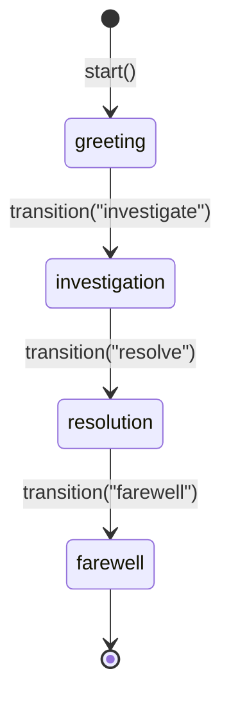

# Layer 2: ConversationFlow

Build conversation agents where the system prompt evolves across phases -- different blocks activate as the conversation progresses.

## Quick Example

```python
from promptise.prompts.flows import ConversationFlow, TurnContext, phase
from promptise.prompts.blocks import Identity, Rules, Section, OutputFormat

class SupportFlow(ConversationFlow):
    base_blocks = [
        Identity("Customer support specialist", traits=["empathetic", "patient"]),
        Rules(["Never blame the customer", "Keep responses to 2-3 sentences"]),
    ]

    @phase("greeting", initial=True)
    async def greet(self, ctx: TurnContext) -> None:
        ctx.activate(Section("greet", "Ask how you can help today."))

    @phase("investigate")
    async def investigate(self, ctx: TurnContext) -> None:
        ctx.deactivate("greet")
        ctx.activate(Section("investigate", "Ask clarifying questions."))

    @phase("resolve")
    async def resolve(self, ctx: TurnContext) -> None:
        ctx.deactivate("investigate")
        ctx.activate(OutputFormat(format="markdown"))
        ctx.activate(Section("resolve", "Propose a concrete solution."))

flow = SupportFlow()
prompt = await flow.start("Hi")                    # Enter greeting phase with the first message
prompt = await flow.next_turn("My app crashed")    # Process user message
await flow.transition("investigate")               # Move to investigate
prompt = await flow.next_turn("It crashes on login")
```

A flow instance holds the state of **one** conversation. To use a flow in an agent, pass it to `build_agent()`, which keeps a separate copy per session ([Integration with `build_agent`](#integration-with-build_agent)).

## Concepts

A `ConversationFlow` is a state machine where:

- **Phases** define distinct conversation stages (greeting, investigation, resolution)
- **Base blocks** are always included in the prompt regardless of phase
- **Phase handlers** activate and deactivate blocks as the conversation evolves
- The system prompt is **not static** -- it is reassembled every turn with the currently active blocks

Each call to `next_turn()` or `transition()` runs the current phase handler, which can modify the active block composition, then returns a freshly assembled `AssembledPrompt`.



## Defining a Flow

### Subclass `ConversationFlow`

Set `base_blocks` as a class variable for blocks that are always active:

```python
from promptise.prompts.flows import ConversationFlow
from promptise.prompts.blocks import Identity, Rules

class MyFlow(ConversationFlow):
    base_blocks = [
        Identity("Helpful assistant"),
        Rules(["Be concise", "Ask before making assumptions"]),
    ]
```

### Define Phases with `@phase`

Use the `@phase` decorator on async methods. Mark exactly one phase as `initial=True`:

```python
from promptise.prompts.flows import phase, TurnContext
from promptise.prompts.blocks import Section, OutputFormat

class MyFlow(ConversationFlow):
    base_blocks = [Identity("Assistant")]

    @phase("greeting", initial=True)
    async def greet(self, ctx: TurnContext) -> None:
        ctx.activate(Section("greet", "Welcome the user warmly."))

    @phase("working", blocks=[OutputFormat(format="json")])
    async def work(self, ctx: TurnContext) -> None:
        ctx.deactivate("greet")
        ctx.activate(Section("work", "Focus on completing the task."))
```

The `@phase` decorator accepts:

| Parameter | Type | Description |
|-----------|------|-------------|
| `name` | `str` | Phase name (used for transitions) |
| `initial` | `bool` | Whether this is the starting phase (exactly one required) |
| `blocks` | `list[Block]` | Blocks auto-activated on phase entry, auto-deactivated on exit |
| `on_enter` | `Callable` | Callback invoked when entering this phase |
| `on_exit` | `Callable` | Callback invoked when leaving this phase |

## TurnContext

Every phase handler receives a `TurnContext` that provides methods to manipulate the prompt and control flow.

### Properties

| Property | Type | Description |
|----------|------|-------------|
| `turn` | `int` | Current turn number (0-based) |
| `phase` | `str` | Current phase name |
| `state` | `dict[str, Any]` | Arbitrary flow state dict -- mutate freely |
| `history` | `list[dict]` | Conversation message history (read-only copy) |

### Block Manipulation

```python
@phase("investigate")
async def investigate(self, ctx: TurnContext) -> None:
    # Remove a block from the active composition
    ctx.deactivate("greeting_instructions")

    # Add a new block
    ctx.activate(Section("investigate", "Ask clarifying questions."))

    # Fill a ContextSlot by name
    ctx.fill_slot("user_info", "Premium customer since 2023")
```

| Method | Description |
|--------|-------------|
| `activate(block)` | Add a block to the active prompt composition |
| `deactivate(name)` | Remove a block by name |
| `fill_slot(name, value)` | Fill a `ContextSlot` block by name |
| `transition(phase_name)` | Request a phase transition (happens after handler completes) |
| `get_prompt()` | Assemble the current prompt without advancing the turn |

### In-Handler Transitions

Call `ctx.transition()` inside a phase handler to request a transition after the current handler completes:

```python
@phase("greeting", initial=True)
async def greet(self, ctx: TurnContext) -> None:
    if ctx.state.get("returning_customer"):
        ctx.transition("working")  # Skip to working phase
    else:
        ctx.activate(Section("greet", "Welcome! How can I help?"))
```

## Flow Lifecycle

### Starting the Flow

`start()` enters the initial phase, runs its handler, and returns the first assembled prompt. Pass the conversation's first user message so the initial phase handler can act on it (it is recorded in `ctx.history` as turn 0):

```python
flow = SupportFlow()
prompt = await flow.start("Hi, my app keeps crashing")
print(prompt.text)              # Full prompt with base + greeting blocks
print(prompt.included)          # ["identity", "rules", "greeting_instructions"]
```

`start()` with no argument still works and starts the flow before any message arrives.

### Processing Turns

`next_turn()` records the user message in history, runs the current phase handler, and returns the updated prompt:

```python
prompt = await flow.next_turn("My app keeps crashing")
print(prompt.text)  # Prompt reflects current phase blocks
```

Optional parameters:

```python
prompt = await flow.next_turn(
    "Details about the crash",
    assistant_message="I understand, let me help.",  # Record assistant reply
    transition_to="resolution",   # Force a phase transition before processing
)
```

### Explicit Transitions

`transition()` moves to a new phase, runs the new phase handler, and returns the updated prompt:

```python
prompt = await flow.transition("resolution")
```

### Reading the Current Prompt

`get_prompt()` assembles the current state without advancing the turn counter:

```python
prompt = flow.get_prompt()
```

### Resetting

`reset()` clears all state, history, active blocks, and the turn counter:

```python
flow.reset()
# Flow is now back to its initial state, ready for start()
```

### Token Budget

Cap the assembled prompt with `token_budget`, as a class attribute or a constructor argument. Over budget, blocks are dropped lowest-priority first, exactly as in [`PromptAssembler`](blocks.md#token-budgeting). Dropped blocks are listed in `prompt.excluded`.

```python
class SupportFlow(ConversationFlow):
    token_budget = 1500          # every instance
    ...

flow = SupportFlow(token_budget=800)   # or per instance
```

### Inspecting a Flow

Give the flow a [`PromptInspector`](inspector.md) and every `start()`, `next_turn()` and `transition()` records a trace with the blocks included and excluded, the token estimate, the prompt text, and `flow_phase` / `flow_turn`:

```python
from promptise.prompts.inspector import PromptInspector

inspector = PromptInspector()
flow = SupportFlow(inspector=inspector)   # or set `inspector = ...` on the class
await flow.start("Hi")
trace = inspector.last()
print(trace.prompt_name, trace.flow_phase, trace.flow_turn)   # SupportFlow greeting 0
```

## Integration with `build_agent`

Pass a flow to `build_agent()` and the system prompt evolves with each message:

```python
import asyncio
from promptise import build_agent
from promptise.config import HTTPServerSpec

async def main():
    agent = await build_agent(
        model="openai:gpt-5-mini",
        servers={"support": HTTPServerSpec(url="http://localhost:8080/mcp")},
        flow=SupportFlow(),
        instructions="Use the tools to look up orders.",   # optional
    )
    try:
        reply = await agent.chat("My mug arrived broken.", session_id="sess-1", user_id="dana")
        reply = await agent.chat("The order is A-1001.", session_id="sess-1", user_id="dana")
        print(agent.get_flow("sess-1", user_id="dana").get_prompt().included)
    finally:
        await agent.shutdown()

asyncio.run(main())
```

### One flow per conversation

A flow carries one conversation's phase, history, `ctx.state` and slot fills, so the agent never shares one between conversations. The flow you pass is a **template**: each conversation gets its own deep copy. You can also pass the class (`flow=SupportFlow`) or any zero-argument factory (`flow=lambda: SupportFlow(business_customer=True)`), which is called once per conversation. If your flow holds something that can't be deep-copied (a client, a lock), pass a factory: `build_agent()` raises `TypeError` otherwise.

The agent picks the conversation from the call:

| Call | Flow state kept per |
|------|---------------------|
| `agent.chat(msg, session_id=...)` | session, scoped to its `caller` / `user_id` |
| `agent.ainvoke(input, session_id=...)` | session, scoped to its `caller` |
| `agent.ainvoke(input, caller=CallerContext(user_id=...))` | caller (tenant and user) |
| `agent.ainvoke(input)` with neither | nothing kept: a fresh flow built from the messages in `input` |

When the agent first sees a conversation, it starts a new flow and feeds it every user message in the input, in order: the first message goes to `start()`, the rest to `next_turn()`. After that, each call feeds only the newest user message. So a conversation whose history is passed in (from a conversation store after a restart, or a full `messages` list with no `session_id`) resumes in the right phase. The agent keeps up to 10,000 flows; the least recently used is dropped and rebuilt the same way when that conversation continues. `delete_session()` drops the session's flow.

!!! note "Phase handlers replay"
    Rebuilding a flow runs its phase handlers once per earlier user message. Keep handlers free of side effects (they should only read `ctx.history` and `ctx.state` and change blocks), or pass a `session_id` so the flow is built once.

Use `agent.get_flow(session_id, caller=..., user_id=...)` to read a conversation's flow, for example its phase (`flow.current_phase`) or its current prompt (`flow.get_prompt()`). The template you passed to `build_agent()` is never advanced.

### What the model receives

The model gets **one** system message: the flow's prompt for this turn, then your `instructions`, then the list of available tools. Without `instructions`, nothing is added to the flow's prompt; the generic default system prompt is only used when there is no flow.

!!! warning "Not on streaming calls"
    Flows run on `ainvoke()`, `invoke()` and `chat()`. `astream()` and `astream_with_tools()` don't advance a flow, and neither does an agent built with a `context_engine`.

## Full Example: Customer Support Agent

```python
import asyncio
from promptise.prompts import prompt
from promptise.prompts.blocks import Identity, Rules, Section, OutputFormat
from promptise.prompts.flows import ConversationFlow, TurnContext, phase

class SupportFlow(ConversationFlow):
    base_blocks = [
        Identity(
            "Customer support specialist for TechCorp",
            traits=["empathetic", "patient", "solution-oriented"],
        ),
        Rules([
            "Never blame the customer",
            "Acknowledge frustration before problem-solving",
            "Keep responses to 2-3 sentences",
        ]),
    ]

    @phase("greeting", initial=True)
    async def greet(self, ctx: TurnContext) -> None:
        ctx.activate(Section(
            "greeting_instructions",
            "Warmly greet the customer. Ask how you can help today.",
        ))

    @phase("investigation")
    async def investigate(self, ctx: TurnContext) -> None:
        ctx.deactivate("greeting_instructions")
        ctx.activate(Section(
            "investigation_instructions",
            "Ask clarifying questions: what happened, when, what they tried.",
        ))

    @phase("resolution")
    async def resolve(self, ctx: TurnContext) -> None:
        ctx.deactivate("investigation_instructions")
        ctx.activate(Section("resolution_instructions", "Propose a concrete fix."))
        ctx.activate(OutputFormat(format="markdown"))

    @phase("farewell")
    async def farewell(self, ctx: TurnContext) -> None:
        ctx.deactivate("resolution_instructions")
        ctx.deactivate("output_format")
        ctx.activate(Section("farewell_instructions", "Thank the customer."))

@prompt(model="openai:gpt-5-mini")
async def respond(system_prompt: str, conversation: str) -> str:
    """{system_prompt}

Conversation so far:
{conversation}

Respond as the support agent:"""

async def main():
    flow = SupportFlow()
    assembled = await flow.start()

    # Greeting
    response = await respond(
        system_prompt=assembled.text,
        conversation="(Customer just connected)",
    )
    print(f"Agent: {response}")

    # Customer describes issue -> transition to investigation
    assembled = await flow.next_turn(
        "My app crashes on file upload",
        transition_to="investigation",
    )
    response = await respond(
        system_prompt=assembled.text,
        conversation="Customer: My app crashes on file upload",
    )
    print(f"Agent: {response}")

asyncio.run(main())
```

## API Reference

### ConversationFlow

| Method | Returns | Description |
|--------|---------|-------------|
| `ConversationFlow(*, token_budget=None, inspector=None)` | | Create a flow; both default to the class attributes |
| `start(user_message=None)` | `AssembledPrompt` | Enter initial phase (with the first message) and return first prompt |
| `next_turn(user_message, ...)` | `AssembledPrompt` | Process a turn and return updated prompt |
| `transition(phase_name)` | `AssembledPrompt` | Transition to a new phase |
| `get_prompt()` | `AssembledPrompt` | Get current prompt without advancing turn |
| `reset()` | `None` | Reset to initial state |
| `current_phase` | `str \| None` | Current phase name (property), `None` before `start()` |

### TurnContext

| Method | Description |
|--------|-------------|
| `activate(block)` | Add a block to the active composition |
| `deactivate(name)` | Remove a block by name |
| `fill_slot(name, value)` | Fill a ContextSlot |
| `transition(phase_name)` | Request a deferred phase transition |
| `get_prompt()` | Assemble and return current prompt |

!!! warning "One initial phase required"
    Exactly one phase must be marked `initial=True`. Defining zero or multiple initial phases raises a `ValueError`.

## Tips

- Use `ctx.state` to track conversation metadata (e.g., `questions_asked`, `issue_category`) across phases.
- Phase handlers run on every turn within that phase -- use them to dynamically adjust blocks based on conversation progress.
- Blocks from `@phase(blocks=[...])` are automatically activated on phase entry and deactivated on exit. Blocks added via `ctx.activate()` persist until explicitly deactivated.
- `flow._history` stores all user and assistant messages. Use `ctx.history` for a read-only copy inside handlers.
- Run a flow by hand (as in the full example) when you drive the model yourself. Create one flow per conversation and keep it with that conversation.

## What's Next?

- [Strategies](strategies.md) -- Prompt strategies and composition patterns
- [Layer 1: PromptBlocks](blocks.md) -- Composable prompt components reference
